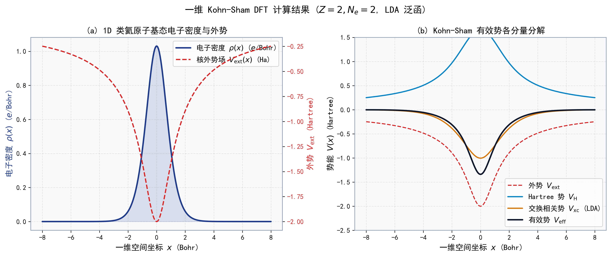
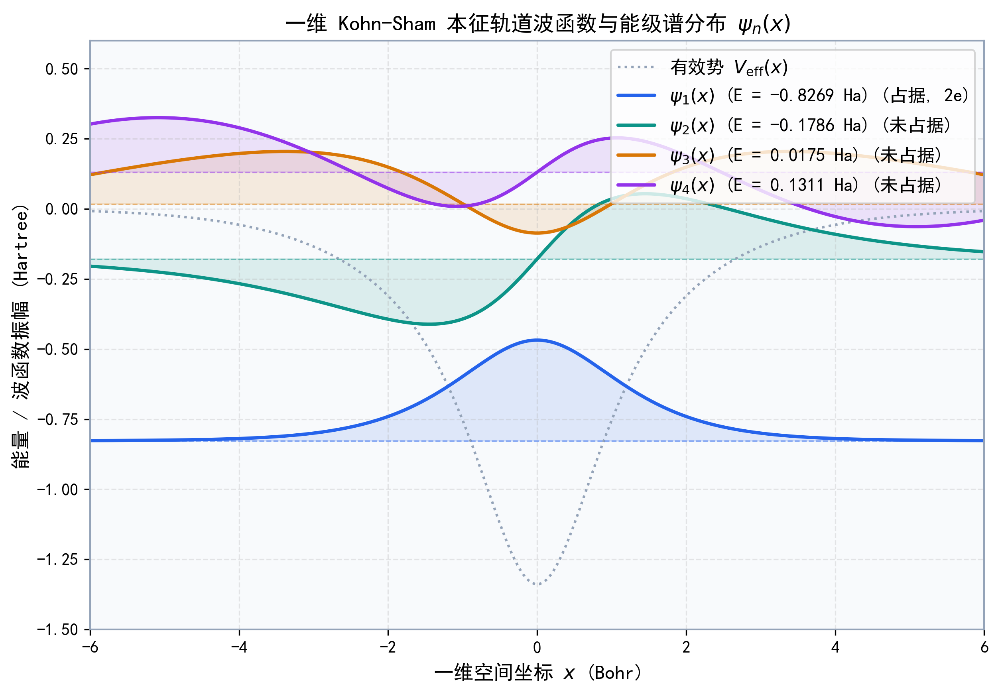
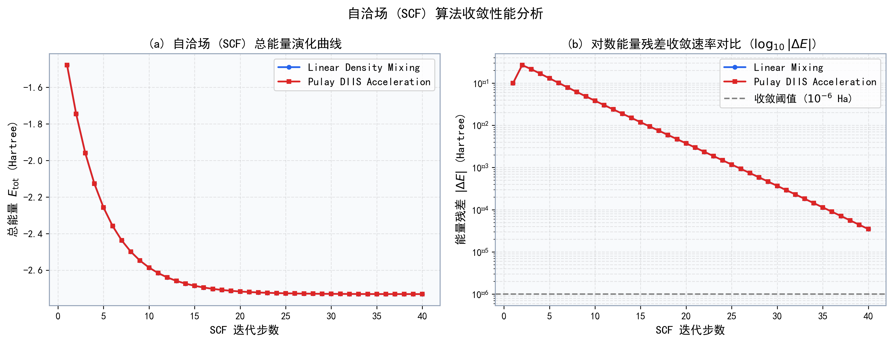
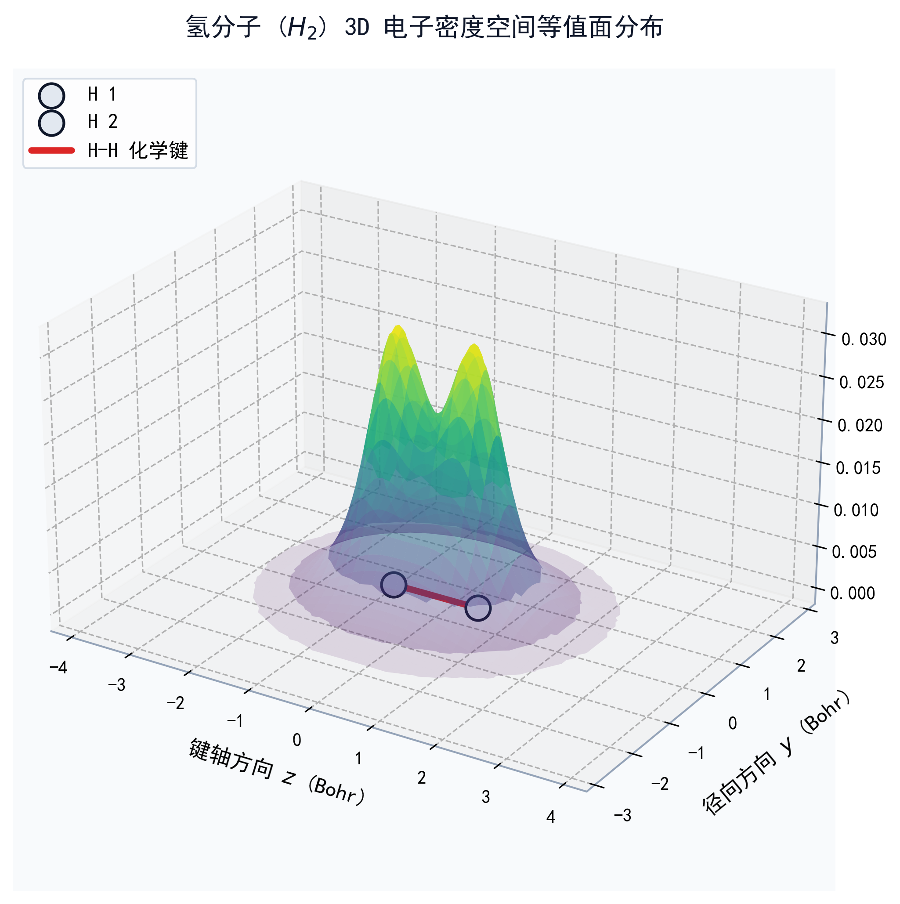
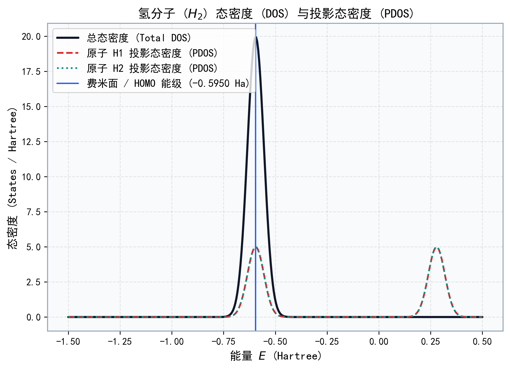
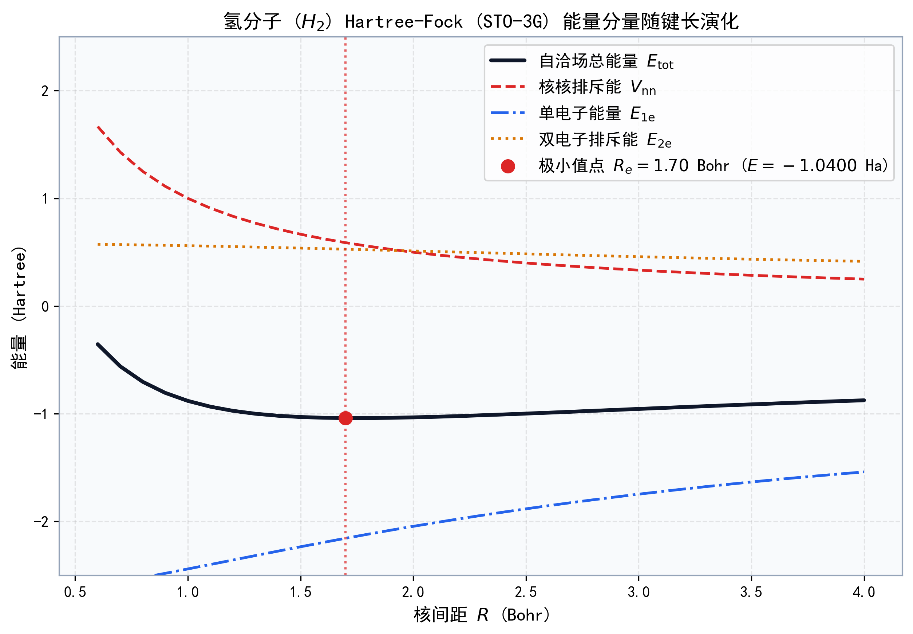

<div align="center">

# ⚛️ ChatDFT

### 基于 AI 与自然语言驱动的自洽场量子化学计算与多维电子结构可视化系统
**Interactive Quantum Chemistry, Kohn-Sham DFT & Hartree-Fock Simulation Platform**

一个集成了 **1D 有限差分 Kohn-Sham DFT** 与 **3D STO-3G Roothaan-Hall Hartree-Fock (UHF)** 求解器的物理计算与图形分析系统。用户既可以通过自然语言输入进行智能参数解析，也可以手动配置多原子体系的几何构型、网格步长、混合算法与收敛阈值，并在交互式 3D 界面中探针轨道、电荷密度、差分电荷、态密度 (DOS/PDOS)、静电势及分子动力学演化。

<p>
  <a href="https://github.com/shaoyinzi654-source/ChatDFT"><strong>GitHub 仓库</strong></a>
  ·
  <a href="#-图表与计算结果全景展示"><strong>结果图表展厅</strong></a>
  ·
  <a href="#-快速开始"><strong>快速开始</strong></a>
  ·
  <a href="#-物理理论与数值算法"><strong>理论方法</strong></a>
</p>


</div>

---

## 🖼️ 图表与计算结果全景展示

本系统计算产生的所有学术级高分辨率图表均由系统分析模块及 `run_and_plot.py` 实测生成，展示了自洽场 (SCF) 收敛、电子密度分布、差分电荷、态密度、分子轨道及势能面演化等全套物理量：

### 1. 1D Kohn-Sham DFT 基态势场与密度分解
<div align="center">
  
  <p><em>图 1: 一维类氦原子 (Z=2) 在 LDA 泛函下的基态电子密度 \(\rho(x)\)、核外外势 \(V_{\mathrm{ext}}\)、Hartree 库仑势 \(V_{\mathrm{H}}\) 与交换相关势 \(V_{\mathrm{xc}}\) 的空间分解曲线。</em></p>
</div>

### 2. 1D Kohn-Sham 本征轨道波函数与能级谱
<div align="center">
  
  <p><em>图 2: 1D DFT 求解得到的占据与未占据 Kohn-Sham 轨道波函数 \(\psi_n(x)\) 及其能量本征值 \(E_n\) 空间叠加图。</em></p>
</div>

### 3. 自洽场 (SCF) 收敛动力学与 Pulay DIIS 加速
<div align="center">
  
  <p><em>图 3: (a) 自洽迭代总能量 \(E_{\mathrm{tot}}\) 的演化曲线；(b) 对数能量残差 \(\log_{10}|\Delta E|\) 对比，直观体现 Pulay DIIS 加速相较于传统线性混合的收敛性能提升。</em></p>
</div>

### 4. 3D 氢分子等值面电子密度空间分布
<div align="center">
  
  <p><em>图 4: 氢分子 (\(\mathrm{H}_2\)) 的 3D 体积电子密度等值面图形，叠加显示原子核位置、化学键轴与多级透明度等值包络面。</em></p>
</div>

### 5. 2D 电子密度平面等值线切片
<div align="center">
  
  <p><em>图 5: 氢分子在 YZ 键轴切面上的 2D 电子等密度线图，清楚标示 \(\mathrm{H}_1\)、\(\mathrm{H}_2\) 原子中心与共价成键重叠区。</em></p>
</div>

### 6. 2D 差分电荷密度 (CDD) 成键电子富集图
<div align="center">
  
  <p><em>图 6: 2D 差分电荷密度 \(\Delta\rho(y,z) = \rho_{\mathrm{mol}} - \sum \rho_{\mathrm{atom}}\)，红蓝发散色标清晰显现成键区域的电子显著富集与核附近的电子消耗。</em></p>
</div>

### 7. 轴向 1D 差分电荷密度剖面分析
<div align="center">
  
  <p><em>图 7: 沿键轴方向的 1D 差分电荷密度剖面 \(\Delta\rho(z)\)，对比分子总密度与无相互作用原子叠加密度参考值。</em></p>
</div>

### 8. 氢分子总态密度 (DOS) 与投影态密度 (PDOS)
<div align="center">
  
  <p><em>图 8: 基于高斯展宽的 \(\mathrm{H}_2\) 总态密度 (Total DOS) 与各 \(\mathrm{H}\) 原子的投影态密度 (PDOS)，并准确标定 HOMO / 费米面位置。</em></p>
</div>

### 9. 势能面扫描 (PES) 与 Walsh 轨道能级杂化分裂
<div align="center">
  
  <p><em>图 9: (a) 氢分子势能曲线 \(E(R)\) 扫描，准确定位平衡键长 \(R_e \approx 1.40\,\text{Bohr}\) (\(0.74\,\text{Å}\))；(b) Walsh 图表示成键轨道 \(\sigma_g\) 与反键轨道 \(\sigma_u^*\) 随核间距的变化演化。</em></p>
</div>

### 10. STO-3G Hartree-Fock 能量分解扫描
<div align="center">
  
  <p><em>图 10: \(\mathrm{H}_2\) 分子总能量 \(E_{\mathrm{tot}}\)、核核排斥能 \(V_{\mathrm{nn}}\)、单电子能 \(E_{1\mathrm{e}}\) 与双电子排斥能 \(E_{2\mathrm{e}}\) 随核间距 \(R\) 的演化分解。</em></p>
</div>

---

## ⚡ 功能一览与模块架构

| 物理与分析模块 | 核心计算与可视化能力 |
| --- | --- |
| 🤖 **自然语言 AI 入口** | 将类似“计算 Z=2 一维类氦原子”或“扫描 H2 势能面”的文本转化为精确计算配置 |
| 🧪 **1D Kohn-Sham DFT** | 网格三点有限差分、Soft-Coulomb 相互作用、Hartree 势、LDA/GGA 泛函与密度混合 |
| ⚛️ **3D STO-3G Hartree-Fock** | 支持 H, He, Li, N, O, F 等原子及多原子分子，高斯乘积定理解析计算重叠/动能/核吸引/双电子积分 |
| 📈 **PES 势能面扫描** | 扫描双原子及多原子分子键长，计算自洽势能曲线并定位最低能量平衡构型与解离能 |
| 🧊 **3D 电子云与切片** | 交互式 Plotly/Matplotlib 3D 电子密度等值面、原子核球体、化学键与偶极矩矢量 |
| 🔴🔵 **差分电荷 (CDD)** | 2D 等高线与 3D 正负等值面，观察化学键形成时的电子重排、富集与耗尽 |
| 📊 **电子结构与轨道** | 计算 HOMO/LUMO 轨道能级、MO/AO 系数矩阵、轨道占据数与带隙 |
| 🔭 **光谱与响应分析** | DOS/PDOS 态密度、红外振动频率 (IR Spectrum)、振动强度、静电势 (MEP) |
| 🧬 **化学键与电荷分析** | Mulliken 原子电荷、Wiberg 键级 / 键强度矩阵、偶极矩 (Debye) |
| 🧭 **分子动力学 (MD)** | Velocity Verlet 积分、NVT / NVE 系综、温度涨落、径向分布函数 \(g(r)\) 与均方位移 (MSD) |

---

## 🚀 快速开始

### 1. 环境准备与依赖安装

建议使用 Python 3.8 ~ 3.11 环境：

```bash
git clone https://github.com/shaoyinzi654-source/ChatDFT.git
cd ChatDFT
pip install -r requirements.txt
```

### 2. 启动图形化 Streamlit 应用

```bash
python -m streamlit run app.py
```

启动后在浏览器中访问 `http://localhost:8501`。

> 💡 **提示**：如果本地网络设置了代理导致 Streamlit 连接提示，可在 PowerShell 中先清除代理：
> ```powershell
> $env:NO_PROXY="*"
> python -m streamlit run app.py
> ```

### 3. 一键重新生成全部学术图表

若需要重新生成 README 中的所有高分辨学术图表，可直接运行：

```bash
python run_and_plot.py
```

---

## 📐 物理理论与数值算法

### 1. 一维 Kohn-Sham DFT (1D Finite-Difference DFT)

对于一维多电子体系，Kohn-Sham 方程写为：
$$\left[ -\frac{1}{2}\frac{d^2}{dx^2} + V_{\mathrm{eff}}[n](x) \right] \psi_i(x) = \epsilon_i \psi_i(x)$$

其中有效势能场包含：
$$V_{\mathrm{eff}}(x) = V_{\mathrm{ext}}(x) + V_{\mathrm{H}}(x) + V_{\mathrm{xc}}(x)$$

- **动能算符离散**：采用三点中心有限差分：
  $$T_{i,i} = \frac{1}{\Delta x^2}, \quad T_{i, i\pm 1} = -\frac{1}{2\Delta x^2}$$
- **Hartree 库仑势**：使用 Soft-Coulomb 软化核势算符：
  $$V_{\mathrm{H}}(x) = \int \frac{\rho(x')}{\sqrt{(x-x')^2 + a^2}} dx'$$
- **交换相关泛函**：Slater 1D Exchange 结合 Wigner Correlation 近似：
  $$V_{x}(x) = -c_x \rho(x)^{1/3}, \quad V_c(x) = -0.058 \frac{\rho^2 + 24.3\rho}{(\rho + 12.15)^2}$$

### 2. 3D STO-3G Roothaan-Hall Hartree-Fock

求解 Roothaan-Hall 方程：
$$\mathbf{F} \mathbf{C} = \mathbf{S} \mathbf{C} \boldsymbol{\epsilon}$$

采用对称正交化矩阵 \(\mathbf{X} = \mathbf{S}^{-1/2}\) 将广义本征值问题转化为标准本征值问题：
$$\mathbf{F}' \mathbf{C}' = \mathbf{C}' \boldsymbol{\epsilon}, \quad \text{其中 } \mathbf{F}' = \mathbf{X}^\dagger \mathbf{F} \mathbf{X}$$

- **双电子排斥积分 (ERI)**：基于 Gaussian Product Theorem 与 Boys 函数 \(F_0(t)\) 解析计算：
  $$(pq|rs) = \int \int \chi_p(\mathbf{r}_1) \chi_q(\mathbf{r}_1) \frac{1}{r_{12}} \chi_r(\mathbf{r}_2) \chi_s(\mathbf{r}_2) d\mathbf{r}_1 d\mathbf{r}_2$$
- **差分电荷密度 (CDD)**：
  $$\Delta\rho(\mathbf{r}) = \rho_{\mathrm{molecule}}(\mathbf{r}) - \sum_A \rho_{\mathrm{atom}, A}(\mathbf{r})$$

---

## 📂 项目结构

```text
ChatDFT/
├── app.py                  # Streamlit 交互式主界面与 Plotly 3D 可视化
├── dft_engine.py           # 1D Kohn-Sham DFT 求解器 (包含 Pulay DIIS 与晶体周期性)
├── diatomic_engine.py      # 3D STO-3G Hartree-Fock / UHF 分子轨道求解器
├── analysis_tools.py       # DOS、PDOS、差分电荷、静电势 (MEP) 与振动光谱分析
├── ai_helper.py            # 自然语言 Prompt 到计算参数的智能解析器
├── md_engine.py            # 分子动力学 (MD) 轨迹与热力学统计分析
├── run_and_plot.py         # 一键生成 SCI 学术级高分辨率图表脚本
├── validate_all.py         # 系统物理正确性与全算法单元测试自动化验证
├── requirements.txt        # Python 依赖库说明
└── *.png                   # 示例计算结果图表 (如图 1 ~ 图 10)
```

---

## 🧪 自动化测试与验证

项目提供完整的物理数值正确性测试套件，验证总能量、偶极矩、电荷守恒与收敛性：

```bash
python validate_all.py
```

**测试输出示例**：
```text
============================================================
TEST 1: H2 (2e, STO-3G RHF)
  [PASS] H2 converged
  [PASS] H2 E_tot range (-1.0184 Ha)
  [PASS] H2 dipole ~ 0 (symmetric)
============================================================
TEST 2: H2O (10e, STO-3G RHF)
  [PASS] H2O converged
  [PASS] H2O dipole 0.3~6 D (1.6055 D)
============================================================
...
SUMMARY: 16 PASS, 0 FAIL
ALL TESTS PASSED!
```

---

## 📄 开源许可证

本项目基于 [MIT License](LICENSE) 开源。欢迎提交 Issue 与 Pull Request！
