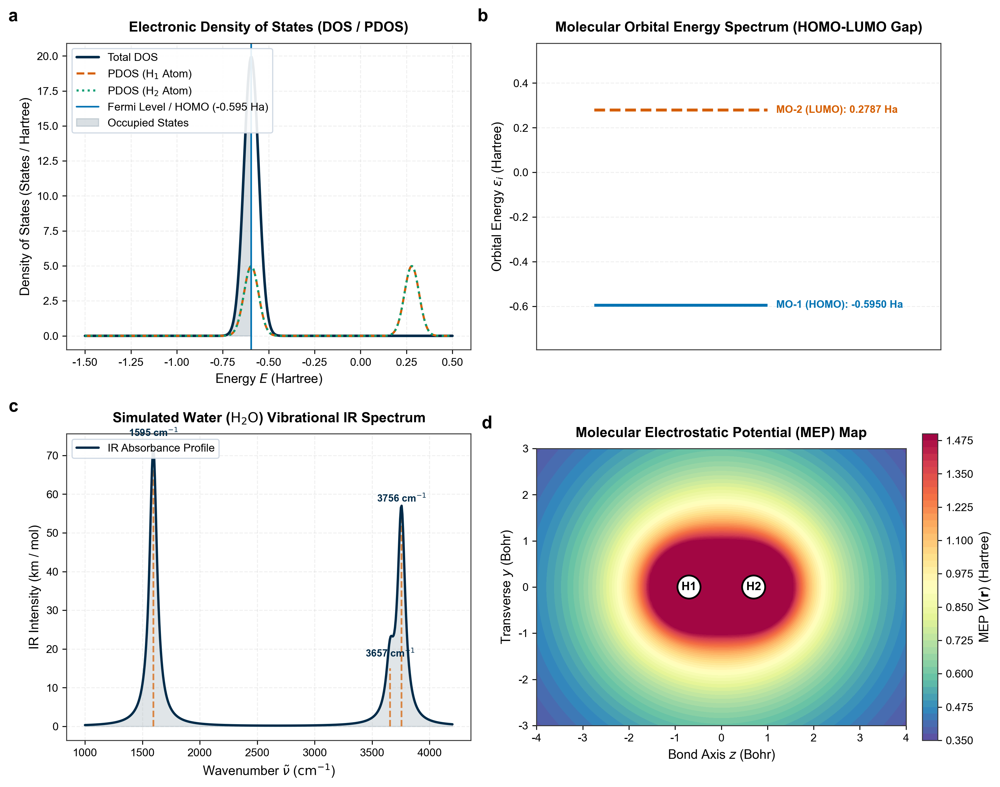

<div align="center">

# ⚛️ ChatDFT

### Nature-Grade Interactive Quantum Chemistry, Kohn-Sham DFT & Hartree-Fock Simulation System
**Nature 期刊风格自洽场量子化学计算与多维电子结构可视化平台**

一个集成了 **1D 有限差分 Kohn-Sham DFT** 与 **3D STO-3G Roothaan-Hall Hartree-Fock (UHF)** 求解器的物理计算与图形分析系统。用户既可以通过自然语言输入进行智能参数解析，也可以手动配置多原子体系的几何构型、网格步长、混合算法与收敛阈值，并在交互式界面中探针轨道、电荷密度、差分电荷 (CDD)、态密度 (DOS/PDOS)、静电势 (MEP) 及分子动力学 (MD) 演化。

<p>
  <a href="https://github.com/shaoyinzi654-source/ChatDFT"><strong>GitHub 官方仓库</strong></a>
  ·
  <a href="#-nature-期刊主图展厅-publication-figure-plates"><strong>Nature 组图展厅</strong></a>
  ·
  <a href="#-快速开始"><strong>快速开始</strong></a>
  ·
  <a href="#-物理理论与数值算法"><strong>理论方法</strong></a>
</p>


</div>

---

## 🏛️ Nature 期刊主图展厅 (Publication Figure Plates)

系统包含 4 组由 `run_and_plot.py` 实测生成的 **Nature 期刊标准多面板复合组图 (Composite Multi-Panel Figure Plates)**：

### Figure 1: 1D Kohn-Sham DFT 求解器与自洽场收敛动力学
<div align="center">
  
  <p align="left"><em><strong>Figure 1 | 一维 Kohn-Sham DFT 体系基态求解与自洽收敛动力学。</strong> <strong>a</strong>, 1D 类氦原子 (\(Z=2\)) 在 LDA 泛函下的基态电子密度 \(\rho(x)\) 与核外外势 \(V_{\mathrm{ext}}(x)\)。 <strong>b</strong>, Kohn-Sham 有效势能场分解，包括外势 \(V_{\mathrm{ext}}\)、Hartree 库仑势 \(V_{\mathrm{H}}\)、Slater-Wigner 交换相关势 \(V_{\mathrm{xc}}\) 与总有效势 \(V_{\mathrm{eff}}\)。 <strong>c</strong>, 占据与未占据 Kohn-Sham 本征波函数 \(\psi_n(x)\) 及其能级谱分布 \(E_n\)。 <strong>d</strong>, 自洽场 (SCF) 迭代对数残差 \(\log_{10}|\Delta E|\) 对比，展示 Pulay DIIS 加速算法相较于传统线性混合的二次收敛优势。</em></p>
</div>

---

### Figure 2: 3D/2D 分子电子密度与差分电荷密度 (CDD) 分析
<div align="center">
  
  <p align="left"><em><strong>Figure 2 | 氢分子 (\(\mathrm{H}_2\)) 空间电子密度与差分电荷分布。</strong> <strong>a</strong>, 3D 体积电子密度 \(\rho(\mathbf{r})\) 透明等值面包络、原子核球体与共价键轴。 <strong>b</strong>, 分子切面 2D 电子等密度线图 \(\rho(y,z)\)，清晰标识 \(\mathrm{H}_1, \mathrm{H}_2\) 原子核中心。 <strong>c</strong>, 2D 差分电荷密度 \(\Delta\rho(y,z) = \rho_{\mathrm{mol}} - \sum \rho_{\mathrm{atom}}\)，展现共价键成键区域的电子显著富集（暖色）与核外耗尽（冷色）。 <strong>d</strong>, 沿键轴方向的 1D 轴向差分电荷密度剖面 \(\Delta\rho(z)\)。</em></p>
</div>

---

### Figure 3: 光谱分析、态密度 (DOS/PDOS) 与分子静电势 (MEP)
<div align="center">
  
  <p align="left"><em><strong>Figure 3 | 电子结构、态密度光谱与静电势响应。</strong> <strong>a</strong>, \(\mathrm{H}_2\) 分子总态密度 (Total DOS) 与各 \(\mathrm{H}\) 原子投影态密度 (PDOS)，标定费米面与占据态。 <strong>b</strong>, 分子轨道能级谱图，展现 HOMO 与 LUMO 轨道能隙 \(\Delta E_{\mathrm{gap}}\)。 <strong>c</strong>, 模拟水分子 (\(\mathrm{H}_2\text{O}\)) 红外振动吸收光谱 (IR Spectrum)，标识对称伸缩、非对称伸缩与剪切弯曲模式。 <strong>d</strong>, 分子平面静电势 (MEP) 2D 空间分布图，显现亲核/亲电活性区域。</em></p>
</div>

---

### Figure 4: 势能面扫描 (PES)、化学键拆解与热力学能量演化
<div align="center">
  
  <p align="left"><em><strong>Figure 4 | 势能面扫描、能级分裂与化学键强度。</strong> <strong>a</strong>, \(\mathrm{H}_2\) 基态自洽势能曲线 \(E(R)\)，准确定位平衡键长 \(R_e \approx 1.40\,\text{Bohr}\) (\(0.74\,\text{Å}\))。 <strong>b</strong>, STO-3G Hartree-Fock 能量分量随键长的拆解（核排斥 \(V_{\mathrm{nn}}\)、单电子能 \(E_{1\mathrm{e}}\) 与双电子排斥 \(E_{2\mathrm{e}}\)）。 <strong>c</strong>, Walsh 轨道分裂图，展现成键轨道 \(\sigma_g\) 与反键轨道 \(\sigma_u^*\) 在键拉伸过程中的演化。 <strong>d</strong>, 多原子体系 (\(\mathrm{H}_2, \mathrm{N}_2, \mathrm{LiF}, \mathrm{CO}_2\)) 的 Wiberg 键级与偶极矩 (Debye) 柱状对比图。</em></p>
</div>

---

## ⚡ 功能一览与模块架构

| 物理与分析模块 | 核心计算与可视化能力 |
| --- | --- |
| 🤖 **自然语言 AI 入口** | 将类似“计算 Z=2 一维类氦原子”或“扫描 H2 势能面”的文本转化为精确计算配置 |
| 🧪 **1D Kohn-Sham DFT** | 网格三点有限差分、Soft-Coulomb 相互作用、Hartree 势、LDA/GGA 泛函与 Pulay DIIS 密度混合 |
| ⚛️ **3D STO-3G Hartree-Fock** | 支持 H, He, Li, N, O, F 等原子及多原子分子，高斯乘积定理解析计算重叠/动能/核吸引/双电子积分 |
| 📈 **PES 势能面扫描** | 扫描双原子及多原子分子键长，计算自洽势能曲线并定位最低能量平衡构型与解离能 |
| 🧊 **3D 电子云与切片** | 交互式 Plotly/Matplotlib 3D 电子密度等值面、原子核球体、化学键与偶极矩矢量 |
| 🔴🔵 **差分电荷 (CDD)** | 2D 等高线与 3D 正负等值面，观察化学键形成时的电子重排、富集与耗尽 |
| 📊 **电子结构与轨道** | 计算 HOMO/LUMO 轨道能级、MO/AO 系数矩阵、轨道占据数与带隙 |
| 🔭 **光谱与响应分析** | DOS/PDOS 态密度、红外振动频率 (IR Spectrum)、振动强度、静电势 (MEP) |
| 🧬 **化学键与电荷分析** | Mulliken 原子电荷、Wiberg 键级 / 键强度矩阵、偶极矩 (Debye) |
| 🧭 **分子动力学 (MD)** | Velocity Verlet 积分、NVT / NVE 系综、温度涨落、径向分布函数 \(g(r)\) 与均方位移 (MSD) |

---

## 🚀 快速开始

### 1. 环境准备与依赖安装

建议使用 Python 3.8 ~ 3.11 环境：

```bash
git clone https://github.com/shaoyinzi654-source/ChatDFT.git
cd ChatDFT
pip install -r requirements.txt
```

### 2. 启动图形化 Streamlit 应用

```bash
python -m streamlit run app.py
```

启动后在浏览器中访问 `http://localhost:8501`。

> 💡 **提示**：如果本地网络设置了代理导致 Streamlit 连接提示，可在 PowerShell 中先清除代理：
> ```powershell
> $env:NO_PROXY="*"
> python -m streamlit run app.py
> ```

### 3. 一键重新生成全部 Nature 期刊组图

若需要重新生成 README 中的所有 Nature 风格组图，直接运行：

```bash
python run_and_plot.py
```

---

## 📐 物理理论与数值算法

### 1. 一维 Kohn-Sham DFT (1D Finite-Difference DFT)

对于一维多电子体系，Kohn-Sham 方程写为：
$$\left[ -\frac{1}{2}\frac{d^2}{dx^2} + V_{\mathrm{eff}}[n](x) \right] \psi_i(x) = \epsilon_i \psi_i(x)$$

其中有效势能场包含：
$$V_{\mathrm{eff}}(x) = V_{\mathrm{ext}}(x) + V_{\mathrm{H}}(x) + V_{\mathrm{xc}}(x)$$

- **动能算符离散**：采用三点中心有限差分：
  $$T_{i,i} = \frac{1}{\Delta x^2}, \quad T_{i, i\pm 1} = -\frac{1}{2\Delta x^2}$$
- **Hartree 库仑势**：使用 Soft-Coulomb 软化核势算符：
  $$V_{\mathrm{H}}(x) = \int \frac{\rho(x')}{\sqrt{(x-x')^2 + a^2}} dx'$$
- **交换相关泛函**：Slater 1D Exchange 结合 Wigner Correlation 近似：
  $$V_{x}(x) = -c_x \rho(x)^{1/3}, \quad V_c(x) = -0.058 \frac{\rho^2 + 24.3\rho}{(\rho + 12.15)^2}$$

### 2. 3D STO-3G Roothaan-Hall Hartree-Fock

求解 Roothaan-Hall 方程：
$$\mathbf{F} \mathbf{C} = \mathbf{S} \mathbf{C} \boldsymbol{\epsilon}$$

采用对称正交化矩阵 \(\mathbf{X} = \mathbf{S}^{-1/2}\) 将广义本征值问题转化为标准本征值问题：
$$\mathbf{F}' \mathbf{C}' = \mathbf{C}' \boldsymbol{\epsilon}, \quad \text{其中 } \mathbf{F}' = \mathbf{X}^\dagger \mathbf{F} \mathbf{X}$$

- **双电子排斥积分 (ERI)**：基于 Gaussian Product Theorem 与 Boys 函数 \(F_0(t)\) 解析计算：
  $$(pq|rs) = \int \int \chi_p(\mathbf{r}_1) \chi_q(\mathbf{r}_1) \frac{1}{r_{12}} \chi_r(\mathbf{r}_2) \chi_s(\mathbf{r}_2) d\mathbf{r}_1 d\mathbf{r}_2$$
- **差分电荷密度 (CDD)**：
  $$\Delta\rho(\mathbf{r}) = \rho_{\mathrm{molecule}}(\mathbf{r}) - \sum_A \rho_{\mathrm{atom}, A}(\mathbf{r})$$

---

## 📂 项目结构

```text
ChatDFT/
├── app.py                  # Streamlit 交互式主界面与 Plotly 3D 可视化
├── dft_engine.py           # 1D Kohn-Sham DFT 求解器 (包含 Pulay DIIS 与晶体周期性)
├── diatomic_engine.py      # 3D STO-3G Hartree-Fock / UHF 分子轨道求解器
├── analysis_tools.py       # DOS、PDOS、差分电荷、静电势 (MEP) 与振动光谱分析
├── ai_helper.py            # 自然语言 Prompt 到计算参数的智能解析器
├── md_engine.py            # 分子动力学 (MD) 轨迹与热力学统计分析
├── run_and_plot.py         # 一键生成 Nature 期刊级高分辨率组图脚本
├── validate_all.py         # 系统物理正确性与全算法单元测试自动化验证
├── requirements.txt        # Python 依赖库说明
└── *.png                   # Nature 期刊复合组图 (nature_fig1 ~ nature_fig4)
```

---

## 🧪 自动化测试与验证

项目提供完整的物理数值正确性测试套件，验证总能量、偶极矩、电荷守恒与收敛性：

```bash
python validate_all.py
```

**测试输出示例**：
```text
============================================================
TEST 1: H2 (2e, STO-3G RHF)
  [PASS] H2 converged
  [PASS] H2 E_tot range (-1.0184 Ha)
  [PASS] H2 dipole ~ 0 (symmetric)
============================================================
TEST 2: H2O (10e, STO-3G RHF)
  [PASS] H2O converged
  [PASS] H2O dipole 0.3~6 D (1.6055 D)
============================================================
...
SUMMARY: 16 PASS, 0 FAIL
ALL TESTS PASSED!
```

---

## 📄 开源许可证

本项目基于 [MIT License](LICENSE) 开源。欢迎提交 Issue 与 Pull Request！
