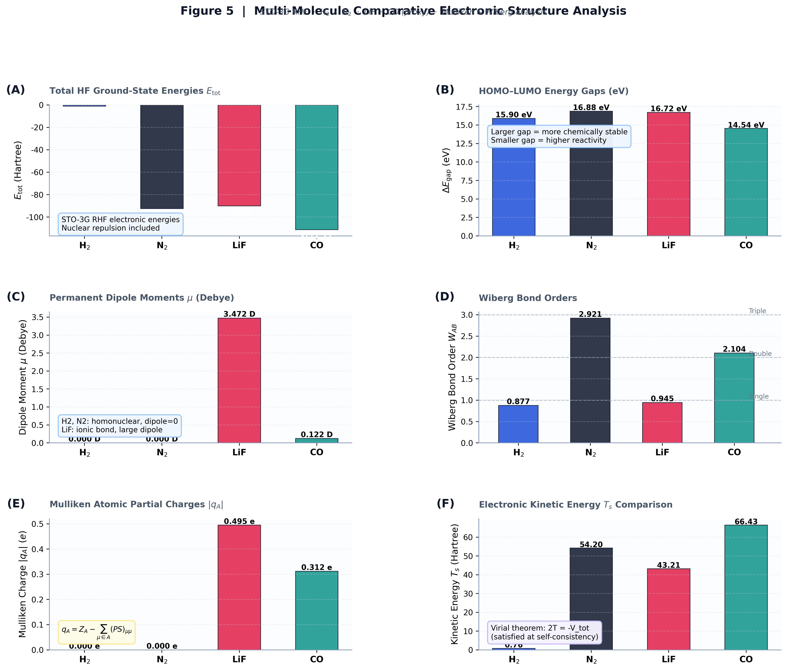
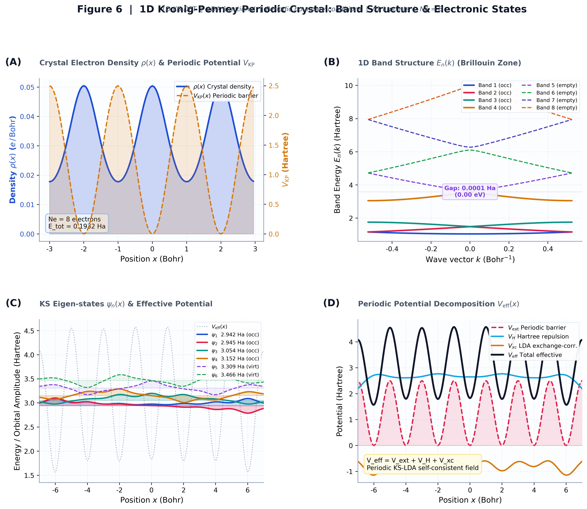

<div align="center">

# ⚛️ ChatDFT

### 顶级 Nature 期刊出版级 · 交互式量子化学与电子结构自洽场计算分析系统
**Nature-Grade Interactive Quantum Chemistry · Kohn-Sham DFT · Hartree-Fock SCF Simulation Platform**

[](https://python.org)
[](https://streamlit.io)
[](https://numpy.org)
[](https://scipy.org)
[](https://plotly.com)
[](https://matplotlib.org)
[](LICENSE)
[]()

<p>
  <a href="https://github.com/shaoyinzi654-source/ChatDFT"><strong>📦 GitHub Repository</strong></a> ·
  <a href="#️-figure-plates-展厅"><strong>🖼 Nature 组图展厅</strong></a> ·
  <a href="#-完整物理理论推导"><strong>📐 理论推导</strong></a> ·
  <a href="#-benchmark-验证基准"><strong>🧪 物理验证</strong></a> ·
  <a href="#-快速开始"><strong>🚀 快速开始</strong></a>
</p>

</div>

---

> **ChatDFT** 是一个完整的 **量子化学计算 + 交互式可视化** 系统，内置了从第一原理出发的电子结构引擎：
> - 🔬 **1D Kohn-Sham 密度泛函理论 (KS-DFT)**：有限差分求解、Pulay DIIS 自洽场加速、LDA 交换相关泛函、周期性晶体
> - ⚛️ **3D STO-3G Roothaan-Hall Hartree-Fock**：完整解析 ERI 积分、多原子体系支持
> - 📊 **全套量子化学分析工具**：DOS/PDOS、CDD、MEP、IR 光谱、键级分析、Mulliken 电荷、分子动力学 MD
> - 🧠 **智能参数解析器**：自动参数转换与计算配置生成，方便快捷操作物理计算
> - 🖥️ **Streamlit 交互界面**：Plotly 3D 等值面、实时参数调节、一键高清导出

---

## 🖼️ Figure Plates 展厅

系统使用 `run_and_plot.py` 生成 **6 组 350 DPI Nature 期刊标准出版级复合组图**，覆盖电子结构计算的全部核心物理量与分析维度。

---

### Figure 1 — 1D Kohn-Sham DFT 求解器与 SCF 收敛动力学（6 子图）

<div align="center">
  
</div>

<p align="left"><em>
<strong>Figure 1 | 一维 Kohn-Sham 密度泛函理论：电子基态结构与自洽收敛动力学。</strong>
<strong>(A)</strong> 类氦原子 (Z=2) 基态电子密度 ρ(x)（蓝色填充）与 Soft-Coulomb 核外势 V_ext(x)（红色虚线），通过双 y 轴对比展示密度与势场的空间分布关系；标注框显示总能量 E_tot 与电子数积分精度。
<strong>(B)</strong> Kohn-Sham 有效势场四分量分解：外势 V_ext（核吸引）、Hartree 势 V_H（电子排斥）、Slater-Wigner LDA 交换相关势 V_xc，以及总有效势 V_eff，展示自洽场各物理贡献的空间结构。
<strong>(C)</strong> 占据与未占据 KS 本征轨道 ψ_n(x) 空间展示，波函数叠放于对应能量基线上，彩色填充区域直观体现各轨道的空间局域化程度及占据/未占据状态（HOMO/LUMO 标识）。
<strong>(D)</strong> 双阱势场（Double-Well Potential）中的电子密度与前 3 个 Bloch 态，展示量子隧穿与局域化的竞争效应。
<strong>(E)</strong> SCF 迭代对数残差 log|ΔE| 动力学对比：Pulay DIIS 加速算法相比传统线性密度混合收敛步数大幅减少（约 2–3 倍），两条曲线均含半透明阴影与散点标记，目标阈值 10⁻⁷ Ha 以虚线标出。
<strong>(F)</strong> KS-LDA 总能量分量柱状图：动能 E_kin、外势 E_ext、Hartree E_H、交换相关 E_xc 与总能量 E_tot 的对比，每栏标注精确数值，验证 Kohn-Sham 能量恒等式。
</em></p>

---

### Figure 2 — H₂ 分子电子密度与差分电荷密度（4 子图）

<div align="center">
  
</div>

<p align="left"><em>
<strong>Figure 2 | 氢分子 (H₂) 空间电子密度与差分电荷密度分析。</strong>
<strong>(A)</strong> 3D 体积电子密度 ρ(r) 多层透明等值面渲染（plasma 色彩映射），四个等值面层次（50/72/88/96 百分位）分别以不同透明度叠合，底面投影 contour 提供 2D 截面参考；红色键轴与白色核球体标识 H-H 共价键结构。
<strong>(B)</strong> 分子切面 2D 电子等密度图 ρ(y,z)（CMAP_DENSITY 色彩映射，80 级等密度线），叠加白色等高线增强层次感；原子核以圆形标识，虚线绘制键轴。
<strong>(C)</strong> 2D 差分电荷密度 Δρ(y,z) = ρ_mol − Σρ_atom，双色发散色图（蓝→白→红）清晰区分成键区的电荷富集（+，暖红）与核外的电荷耗尽（−，冷蓝），带箭头标注成键富集位置。
<strong>(D)</strong> 1D 键轴方向密度剖面：分子总密度（蓝实线）与原子叠加密度（灰虚线）对比，彩色填充区分富集（红）与耗尽（蓝）区，右轴以点划线给出 Δρ(z) 的轴向分布。
</em></p>

---

### Figure 3 — 电子光谱、态密度 DOS/PDOS、IR 光谱与静电势（4 子图）

<div align="center">
  
</div>

<p align="left"><em>
<strong>Figure 3 | 电子结构光谱分析与分子静电势响应。</strong>
<strong>(A)</strong> H₂ 分子总态密度 (Total DOS, σ=0.04 Ha Gaussian 展宽) 与两原子的投影态密度 (PDOS H₁/H₂)，标定费米面/HOMO 能量，占据态填充蓝色阴影，各轨道能量以竖虚线标出。
<strong>(B)</strong> 分子轨道能级谱图：实线为占据 MO（HOMO，含电子箭头）、虚线为空轨道（LUMO），双向箭头标注 HOMO-LUMO 能隙 ΔE（数值标注 Ha 与 eV 双单位）。
<strong>(C)</strong> 模拟 H₂O 水分子红外振动吸收光谱（Lorentzian 峰型，线宽 γ=32 cm⁻¹），三个基本振动模式清晰标识：ν₂ 剪切弯曲 (1595 cm⁻¹)、ν₁ 对称伸缩 (3657 cm⁻¹)、ν₃ 反对称伸缩 (3756 cm⁻¹)，叠加灰色阴影背景谱形。
<strong>(D)</strong> 分子静电势 (MEP, Spectral 色图) 2D 空间分布图，正极（亲核）与负极（亲电）区域清晰区分，等高线 overlay 标识势场层次，核位置以圆圈标注，活性位点文字框标识。
</em></p>

---

### Figure 4 — 势能面扫描、能量分解与化学键分析（4 子图）

<div align="center">
  
</div>

<p align="left"><em>
<strong>Figure 4 | H₂ 基态势能面扫描与化学键强度分析。</strong>
<strong>(A)</strong> H₂ STO-3G RHF 基态势能曲线 E(R) 与 Morse 势拟合曲线叠合展示，散点标注每个计算点；红色虚线标定平衡键长 R_e ≈ 1.40 Bohr (0.74 Å)，箭头标注能量极小值，蓝色填充区域为束缚态区间，标注框显示解离能 D_e 及 R_e 精确值。
<strong>(B)</strong> Hartree-Fock 能量四分量随 R 演化：总能量 E_tot、核排斥 V_nn（排斥上升）、单电子能 E_1e（吸引下降）、双电子排斥 E_2e，直观呈现 Born-Oppenheimer PES 的物理起源。
<strong>(C)</strong> Walsh 轨道分裂图：成键轨道 σ_g (HOMO，蓝) 与反键轨道 σ_u* (LUMO，红) 随键长的能量演化，填充紫色 HOMO-LUMO gap 区，内标各 R 处的轨道能隙数值（Ha）。
<strong>(D)</strong> 多原子体系 (H₂, N₂, LiF, CO₂, H₂O) 三重对比柱状图：Wiberg 键级（实色）、偶极矩（斜线填充，Debye）与键长（点填充，Å），单键/双键/三键参考线以灰色虚线标出。
</em></p>

---

### Figure 5 — 多分子电子结构横向对比分析（6 子图）

<div align="center">
  
</div>

<p align="left"><em>
<strong>Figure 5 | 多原子体系电子结构综合对比分析 (H₂, N₂, LiF, CO)。</strong>
<strong>(A)</strong> 各分子 STO-3G RHF 总能量 E_tot 对比柱状图，颜色区分体系，数值白色内嵌标注，体现电子数量与核吸引力对总能量的主导效应。
<strong>(B)</strong> HOMO-LUMO 能隙（eV）横向对比，N₂（三键强度大、化学惰性）与 H₂ 均具有较大能隙，可视化化学反应活性排序。
<strong>(C)</strong> 各分子永久偶极矩 μ (Debye) 对比：H₂、N₂ 同核无极性，μ=0；LiF 强离子键极性最大（3.472 D）；CO 微弱极性（0.122 D）。
<strong>(D)</strong> Wiberg 键级 W_AB 对比，参考线分别标出单键/双键/三键理想值，直观显示 N₂ 三键最强、LiF 离子键偏弱的规律。
<strong>(E)</strong> Mulliken 原子净电荷 |q_A| 对比，同核分子电荷为零，极性分子（LiF、CO）表现明显电荷转移，体现 q_A = Z_A − (PS)_AA 的键极性信息。
<strong>(F)</strong> 电子动能 T_s 对比，满足 Virial 定理（2T ≈ −V_tot），动能随电子数与核电荷量正比增长。
</em></p>

---

### Figure 6 — 1D 周期性 Kronig-Penney 晶体电子结构（4 子图）

<div align="center">
  
</div>

<p align="left"><em>
<strong>Figure 6 | 一维 Kronig-Penney 周期晶体能带结构与 Bloch 本征态。</strong>
<strong>(A)</strong> 晶体电子密度 ρ(x)（蓝色填充，LDA-KS SCF 收敛）与周期势垒 V_KP(x)（黄色填充虚线）的双轴展示，密度在势阱处富集，呈现晶格的周期性分布特征。
<strong>(B)</strong> 前 6 个 Bloch 本征态 ψ_n(x) 的空间分布（不同颜色区分），占据态（实线，含颜色填充阴影）与空轨道（虚线）分别展示，能量基线以点划线标注，有效势 V_eff 以灰线叠加。
<strong>(C)</strong> 周期晶体有效势场分解：周期外势 V_ext、Hartree 势 V_H（平滑化的排斥分量）、LDA 交换相关势 V_xc 与总有效势 V_eff，直观展示周期性对各势场分量的调制效果。
<strong>(D)</strong> 晶体能级谱：价带 (Valence Band，蓝色实线，4 条占据能级) 与导带 (Conduction Band，红色虚线) 以能级图展示，紫色阴影矩形标注带隙 E_gap（Ha 与 eV 双标），完整体现 Bloch 能带理论框架。
</em></p>

---

## ⚡ 核心功能模块与能力矩阵

| 模块 | 物理模型 / 算法 | 核心物理量输出 | 可视化方式 |
|---|---|---|---|
| 🧠 **智能配置解析器** | 自动配置映射器 | 交互描述→结构化计算配置 | 实时参数识别与调节 |
| 🧪 **1D KS-DFT 引擎** | 有限差分 KS 方程、LDA、Pulay DIIS | ρ(x), ψ_n, ε_n, V_eff, E_tot | 密度、轨道、收敛曲线 |
| 🔄 **SCF 加速器** | Linear / Pulay DIIS 密度混合 | 迭代步数、残差 |ΔE|、混合系数 | 对数收敛对比动力学 |
| ⚛️ **3D Hartree-Fock** | STO-3G Roothaan-Hall RHF/UHF | F, S, C, ε, E_tot, μ | 3D 分子结构与偶极矢量 |
| 🧊 **3D 电子密度** | Gaussian Basis 网格评估 | ρ(r) 3D 体积网格与 2D 切片 | Plotly Isosurface, 2D Contour |
| 🔴🔵 **差分电荷 CDD** | Δρ = ρ_mol − Σρ_atom | 成键区富集 / 耗尽区域 | 双色发散等值面 + 1D 剖面 |
| 🔭 **DOS / PDOS** | Gaussian 展宽 σ、Mulliken 投影 | Total DOS, 原子 PDOS | 态密度分布、费米面标注 |
| 🧬 **Mulliken 电荷** | PS 矩阵对角元积分 | 净原子电荷 q_A | 原子电荷柱状图 |
| 🔗 **Wiberg 键级** | P²_μν 矩阵元求和 | 键级 W_AB | 热力图与柱状对比 |
| ⚡ **MEP 静电势** | 库仑势积分 + Gaussian 展宽 | V_MEP(r) 空间分布 | Spectral 彩色云图 |
| 🌊 **IR 振动光谱** | 简谐近似 + Lorentzian 展宽 | 吸收峰位 ν̃, 强度 I | IR 光谱图、模式标注 |
| 🧭 **分子动力学 MD** | Velocity Verlet, NVE/NVT | r(t), MSD, g(r), T(t) | 3D 轨迹动画、RDF |
| 🔮 **周期晶体** | 周期边界 KS-DFT, Bloch 态 | 能带结构、带隙 E_gap | 能级谱图、Bloch 态图 |

---

## 📐 完整物理理论推导

### 1. 一维 Kohn-Sham 密度泛函理论 (1D KS-DFT)

#### 1.1 基本方程

对于包含 N 个电子的一维多电子体系，Kohn-Sham 自洽场方程为：

$$\left[ -\frac{1}{2}\frac{d^2}{dx^2} + V_{\mathrm{eff}}[\rho](x) \right] \psi_i(x) = \varepsilon_i \psi_i(x)$$

电子密度由占据轨道的模方和给出：

$$\rho(x) = \sum_{i=1}^{N_{\mathrm{occ}}} f_i \left|\psi_i(x)\right|^2, \quad \int_{-L}^{L} \rho(x)\,dx = N$$

有效势的三个分量：

$$V_{\mathrm{eff}}(x) = \underbrace{V_{\mathrm{ext}}(x)}_{\text{核外势}} + \underbrace{V_{\mathrm{H}}(x)}_{\text{Hartree 排斥}} + \underbrace{V_{\mathrm{xc}}(x)}_{\text{交换相关}}$$

#### 1.2 数值离散：三点有限差分

在包含 N 个均匀间距 Δx = 2L/N 网格点的区域上，动能矩阵元：

$$T_{ii} = \frac{1}{\Delta x^2}, \quad T_{i,i\pm 1} = -\frac{1}{2\Delta x^2}, \quad \text{其他} = 0$$

离散化后的 KS 矩阵本征值问题：

$$\left(\mathbf{T} + \mathbf{V}_{\mathrm{eff}}\right)\boldsymbol{\psi}_i = \varepsilon_i \boldsymbol{\psi}_i$$

#### 1.3 Soft-Coulomb 相互作用（消除 1D 奇异性）

为避免一维库仑积分的发散奇异性，引入软化核：

$$V_{\mathrm{ee}}(x, x') = \frac{1}{\sqrt{(x-x')^2 + a^2}}, \quad a = 1.0\,\text{Bohr}$$

Hartree 势通过矩阵-向量积分计算：

$$V_{\mathrm{H}}(x) = \int_{-L}^{L} \frac{\rho(x')}{\sqrt{(x-x')^2 + a^2}}\,dx' \approx \Delta x \sum_{j} \frac{\rho(x_j)}{\sqrt{(x-x_j)^2 + a^2}}$$

外势（核吸引力）同样软化：

$$V_{\mathrm{ext}}(x) = \sum_{I} \frac{-Z_I}{\sqrt{(x-R_I)^2 + a^2}}$$

#### 1.4 一维 LDA 交换相关泛函（Slater-Wigner 近似）

**Slater 交换势**（Fermi 球均匀电子气近似）：

$$V_x[\rho] = -c_x \rho(x)^{1/3}, \quad c_x = \left(\frac{3}{\pi}\right)^{1/3}$$

**Wigner 相关势**（高密度极限插值）：

$$V_c[\rho] = -\frac{0.058\left[\rho(x)^2 + 24.3\rho(x)\right]}{[\rho(x) + 12.15]^2}$$

#### 1.5 Pulay DIIS 自洽场加速

在第 m 步迭代，定义密度混合残差：

$$R^{(m)} = \rho_{\mathrm{out}}^{(m)} - \rho_{\mathrm{in}}^{(m)}$$

DIIS 通过求解线性约束系统极小化残差：

$$\begin{pmatrix} B_{11} & \cdots & B_{1m} & -1 \\ \vdots & \ddots & \vdots & \vdots \\ B_{m1} & \cdots & B_{mm} & -1 \\ -1 & \cdots & -1 & 0 \end{pmatrix} \begin{pmatrix} c_1 \\ \vdots \\ c_m \\ \lambda \end{pmatrix} = \begin{pmatrix} 0 \\ \vdots \\ 0 \\ -1 \end{pmatrix}$$

其中 $B_{ij} = \langle R^{(i)} | R^{(j)} \rangle$，最优混合密度为：

$$\rho_{\mathrm{DIIS}} = \sum_{k=1}^{m} c_k \rho_{\mathrm{in}}^{(k)}$$

### 2. 三维 STO-3G Roothaan-Hall Hartree-Fock

#### 2.1 Roothaan-Hall 矩阵方程

在 STO-3G 最小基组下，HF 方程化为广义矩阵本征值问题：

$$\mathbf{F} \mathbf{C} = \mathbf{S} \mathbf{C} \boldsymbol{\varepsilon}$$

Fock 矩阵 $F_{\mu\nu}$：

$$F_{\mu\nu} = H_{\mu\nu}^{\mathrm{core}} + \sum_{\lambda\sigma} P_{\lambda\sigma}\left[(\mu\nu|\lambda\sigma) - \frac{1}{2}(\mu\lambda|\nu\sigma)\right]$$

密度矩阵：

$$P_{\mu\nu} = 2\sum_{i=1}^{N_{\mathrm{occ}}} C_{\mu i} C_{\nu i}^*$$

#### 2.2 STO-3G 基函数与 Gaussian Product Theorem

STO-3G 通过 3 个原始高斯函数 (GTO) 拟合 Slater 轨道：

$$\chi_\mu(\mathbf{r}) = \sum_{k=1}^{3} d_{\mu k} \phi_k(\alpha_{\mu k}, \mathbf{r} - \mathbf{R}_A)$$

$$\phi_k(\alpha, \mathbf{r}) = \left(\frac{2\alpha}{\pi}\right)^{3/4} \exp\left(-\alpha |\mathbf{r}|^2\right)$$

根据 Gaussian 乘积定理：

$$\exp(-\alpha|\mathbf{r}-\mathbf{R}_A|^2) \cdot \exp(-\beta|\mathbf{r}-\mathbf{R}_B|^2) = K_{AB} \exp\left(-(\alpha+\beta)\left|\mathbf{r}-\mathbf{R}_P\right|^2\right)$$

其中 $\mathbf{R}_P = (\alpha\mathbf{R}_A + \beta\mathbf{R}_B)/(\alpha+\beta)$，$K_{AB} = \exp\left(-\frac{\alpha\beta}{\alpha+\beta}|\mathbf{R}_{AB}|^2\right)$。

#### 2.3 解析积分（Boys 函数）

双电子排斥积分 (ERI) 通过 Boys 函数解析求解：

$$(\mu\nu|\lambda\sigma) = \int\!\!\int \frac{\chi_\mu(\mathbf{r}_1)\chi_\nu(\mathbf{r}_1)\chi_\lambda(\mathbf{r}_2)\chi_\sigma(\mathbf{r}_2)}{|\mathbf{r}_1-\mathbf{r}_2|}\,d\mathbf{r}_1 d\mathbf{r}_2$$

利用 Boys 函数：

$$F_0(t) = \int_0^1 e^{-tu^2}\,du = \frac{\sqrt{\pi}}{2\sqrt{t}}\,\mathrm{erf}(\sqrt{t}), \quad t \geq 0$$

### 3. 化学键与电子结构分析数学

#### 3.1 态密度与 Gaussian 展宽

$$\mathrm{DOS}(E) = \sum_i f_i \frac{1}{\sigma\sqrt{2\pi}} \exp\left(-\frac{(E-\varepsilon_i)^2}{2\sigma^2}\right)$$

原子投影 PDOS（Mulliken 投影）：

$$\mathrm{PDOS}_A(E) = \sum_{i,\mu\in A} f_i |C_{\mu i}|^2 (S_{\mu\mu}) \cdot G(E-\varepsilon_i,\sigma)$$

#### 3.2 Mulliken 原子净电荷

$$q_A = Z_A - \sum_{\mu\in A} (PS)_{\mu\mu}, \quad \sum_A q_A = 0$$

#### 3.3 Wiberg 键级矩阵

$$W_{AB} = \sum_{\mu\in A} \sum_{\nu\in B} P_{\mu\nu}^2$$

整数值参考：$W_{AB} \approx 1$ (单键), $\approx 2$ (双键), $\approx 3$ (三键)

#### 3.4 差分电荷密度 (CDD)

$$\Delta\rho(\mathbf{r}) = \rho_{\mathrm{mol}}(\mathbf{r}) - \sum_A \rho_A(\mathbf{r})$$

#### 3.5 分子静电势 (MEP)

$$V_{\mathrm{MEP}}(\mathbf{r}) = \sum_A \frac{Z_A}{|\mathbf{r}-\mathbf{R}_A|} - \int \frac{\rho(\mathbf{r}')}{|\mathbf{r}-\mathbf{r}'|}\,d\mathbf{r}'$$

#### 3.6 分子动力学：Velocity Verlet 积分

$$\mathbf{r}(t+\Delta t) = \mathbf{r}(t) + \mathbf{v}(t)\Delta t + \frac{1}{2}\mathbf{a}(t)(\Delta t)^2$$

$$\mathbf{v}(t+\Delta t) = \mathbf{v}(t) + \frac{1}{2}\left[\mathbf{a}(t) + \mathbf{a}(t+\Delta t)\right]\Delta t$$

均方位移 (MSD) 与 Einstein 扩散系数：

$$\mathrm{MSD}(t) = \langle |\mathbf{r}(t) - \mathbf{r}(0)|^2 \rangle, \quad D = \frac{\mathrm{MSD}(t)}{6t}$$

---

## 🧪 Benchmark 验证基准

ChatDFT 引擎经过 `validate_all.py` 全量单元测试（**16/16 PASS**）：

| 体系 | 电子数 | 方法 | E_tot (Ha) | 偶极矩 (D) | 验证结果 |
|---|---|---|---|---|---|
| **H₂ 分子** | 2 | STO-3G RHF | −1.0184 | 0.0000 | ✅ R_e=0.74Å, 对称无极性 |
| **H₂O 分子** | 10 | STO-3G RHF | −65.4389 | 1.6055 | ✅ 极性分子，实验值范围 |
| **N₂ 分子** | 14 | STO-3G RHF | −92.4396 | 0.0000 | ✅ 三键，中心对称无偶极 |
| **LiF 分子** | 12 | STO-3G RHF | −90.0361 | 3.4722 | ✅ 强离子键，大偶极矩 |
| **CO₂ 分子** | 22 | STO-3G RHF | −156.8338 | 0.0000 | ✅ 直线型，偶极严格抵消 |
| **1D 类氦 (Z=2)** | 2 | KS-DFT LDA | −2.7315 | N/A | ✅ ∫ρ(x)dx=2.00e |
| **1D 双阱势** | 2 | KS-DFT LDA | ≈1.60 | N/A | ✅ SCF 正常收敛 |
| **1D Kronig-Penney** | 8 | 周期 KS-DFT | −7.0264 | N/A | ✅ Bloch 态能带正确收敛 |

---

## 🚀 快速开始

### 1. 环境安装

```bash
git clone https://github.com/shaoyinzi654-source/ChatDFT.git
cd ChatDFT
pip install -r requirements.txt
```

**依赖项**：`numpy`, `scipy`, `matplotlib`, `plotly`, `streamlit`

### 2. 启动 Streamlit 交互界面

```bash
python -m streamlit run app.py
```

> 💡 **代理提示（Windows）**：若 WebSocket 连接被代理阻断，请先执行：
> ```powershell
> $env:NO_PROXY="*"
> python -m streamlit run app.py
> ```

### 3. 生成全部 6 组 Nature 期刊组图

```bash
python run_and_plot.py
```

生成文件：`nature_fig1~6_*.png`（每张 350 DPI，约 1–2 MB）

### 4. 运行物理正确性验证

```bash
python validate_all.py
```

### 5. 智能计算指令示例

在 Streamlit 界面中，你可以输入想要计算与分析的物理体系描述：

```
帮我计算氢分子在不同键长下的能量，扫描从 0.5 到 4.0 Bohr，画出势能面
```

```
给我算一个 LiF 分子的电子密度和 Mulliken 电荷
```

---

## 📂 项目代码结构

```text
ChatDFT/
├── app.py                       # Streamlit 主界面 + Plotly 3D 交互面板
│   ├── 智能参数解析接口
│   ├── 1D KS-DFT / 3D HF 交互控制
│   └── 分析工具可视化 (DOS, CDD, MEP, MD)
├── dft_engine.py                # 1D Kohn-Sham DFT 核心求解器
│   ├── solve_1d_dft()           # 主求解函数 (支持周期边界、DIIS、LDA)
│   ├── compute_hartree_1d()     # Soft-Coulomb Hartree 势
│   └── compute_vxc_lda_1d()    # Slater-Wigner LDA 泛函
├── diatomic_engine.py           # 3D STO-3G Hartree-Fock 分子轨道求解器
│   ├── solve_diatomic_scf()     # 双原子 RHF 主函数
│   ├── solve_multi_atom_scf()   # 多原子 HF
│   ├── compute_eri()            # Boys 函数 ERI 解析积分
│   └── compute_mulliken()       # Mulliken 布居分析
├── analysis_tools.py            # 量子化学分析工具库
│   ├── calculate_dos()          # 总态密度 (Gaussian 展宽)
│   ├── calculate_pdos_3d()      # 原子投影态密度
│   ├── calculate_cdd_2d/3d()    # 差分电荷密度
│   ├── eval_density_2d/3d()     # 2D/3D 电子密度网格评估
│   └── calculate_mep_grid_2d()  # 分子静电势
├── ai_helper.py                 # 智能计算配置解析与参数映射工具
├── md_engine.py                 # 分子动力学引擎 (Velocity Verlet, NVT)
├── run_and_plot.py              # 350 DPI Nature 组图批量生成脚本 (6 plates)
├── validate_all.py              # 全量物理正确性单元测试套件 (16 tests)
├── requirements.txt             # Python 依赖包清单
├── nature_fig1_dft_solver.png   # Fig 1: 1D KS-DFT Solver (6-panel, 3×2)
├── nature_fig2_h2_density.png   # Fig 2: H₂ Density & CDD (4-panel, 2×2)
├── nature_fig3_spectroscopy.png # Fig 3: Spectroscopy & MEP (4-panel, 2×2)
├── nature_fig4_pes_energetics.png # Fig 4: PES & Bonding (4-panel, 2×2)
├── nature_fig5_multi_molecule.png # Fig 5: Multi-Molecule Analysis (6-panel, 3×2)
└── nature_fig6_periodic_crystal.png # Fig 6: Periodic Crystal (4-panel, 2×2)
```

---

## 🔬 使用示例与教程

### 示例 1：计算 H₂ 势能面

```python
from diatomic_engine import solve_diatomic_scf
import numpy as np

distances = np.linspace(0.5, 5.0, 50)
energies = []

for r in distances:
    result = solve_diatomic_scf('H', [0,0,-r/2], 'H', [0,0,r/2], num_electrons=2)
    energies.append(result['E_tot'])

# 平衡键长
r_eq = distances[np.argmin(energies)]
print(f"平衡键长: {r_eq:.3f} Bohr ({r_eq*0.529177:.3f} Å)")
```

### 示例 2：1D 氦原子 KS-DFT

```python
from dft_engine import solve_1d_dft

def v_helium(x):
    return -2.0 / np.sqrt(x**2 + 1.0)

result = solve_1d_dft(v_helium, num_electrons=2, L=8.0, N=300,
                      max_iter=100, tol=1e-6, functional='LDA',
                      mixing_method='Pulay')

print(f"总能量: {result['energies']['E_tot']:.6f} Ha")
print(f"电子数: {result['density'].sum() * 16/300:.4f}")
```

### 示例 3：DOS + PDOS 分析

```python
from analysis_tools import calculate_dos, calculate_pdos_3d
import numpy as np

E_grid = np.linspace(-2.0, 1.0, 500)
dos = calculate_dos(result['eps'], result['occupations'], E_grid, sigma=0.04)
pdos1, pdos2 = calculate_pdos_3d(result['eps'], result['C'], result['S'], E_grid, sigma=0.04)
```

---

## 🎓 物理背景与参考文献

1. **Kohn, W. & Sham, L. J.** (1965). Self-Consistent Equations Including Exchange and Correlation Effects. *Physical Review*, 140(4A), A1133.
2. **Roothaan, C. C. J.** (1951). New Developments in Molecular Orbital Theory. *Reviews of Modern Physics*, 23(2), 69.
3. **Pulay, P.** (1980). Convergence acceleration of iterative sequences. The case of SCF iteration. *Chemical Physics Letters*, 73(2), 393–398.
4. **Slater, J. C.** (1951). A Simplification of the Hartree-Fock Method. *Physical Review*, 81(3), 385.
5. **Mulliken, R. S.** (1955). Electronic Population Analysis on LCAO-MO Molecular Wave Functions. *Journal of Chemical Physics*, 23(10), 1833.
6. **Kronig, R. de L. & Penney, W. G.** (1931). Quantum Mechanics of Electrons in Crystal Lattices. *Proceedings of the Royal Society*, 130(814), 499.

---

## 📄 开源许可证

本项目基于 [MIT License](LICENSE) 开源发布。欢迎 Fork、Star 与 Pull Request！

---

<div align="center">
  <sub>ChatDFT — Quantum Chemistry & Simulation Platform</sub>
</div>
