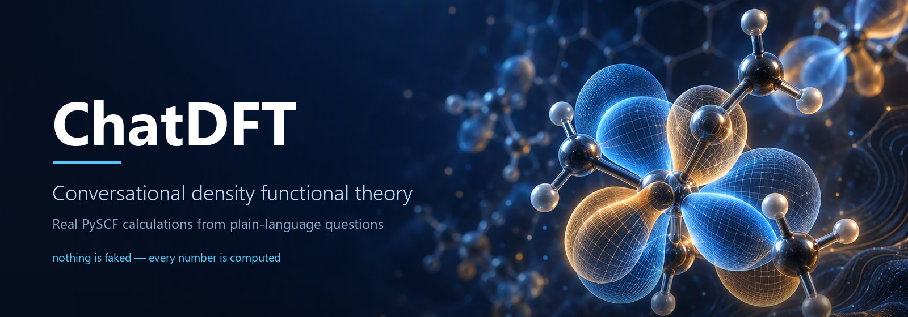
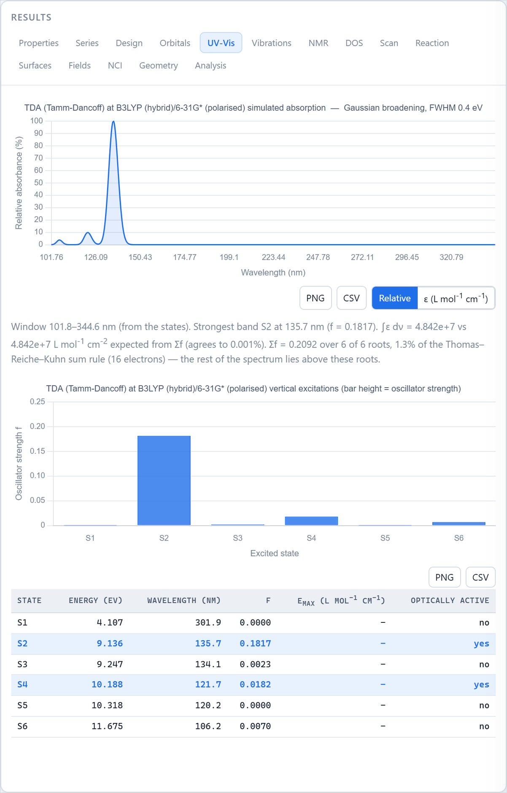
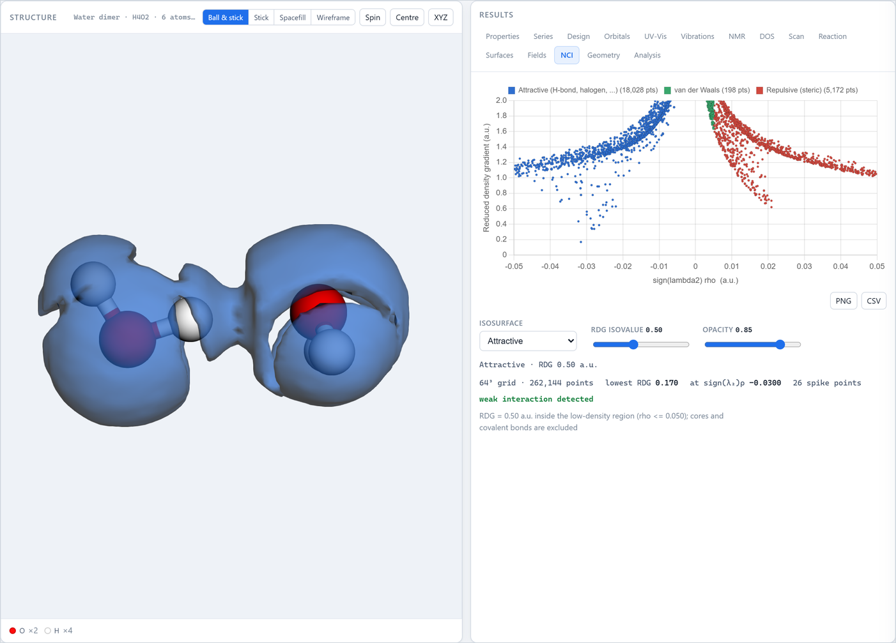
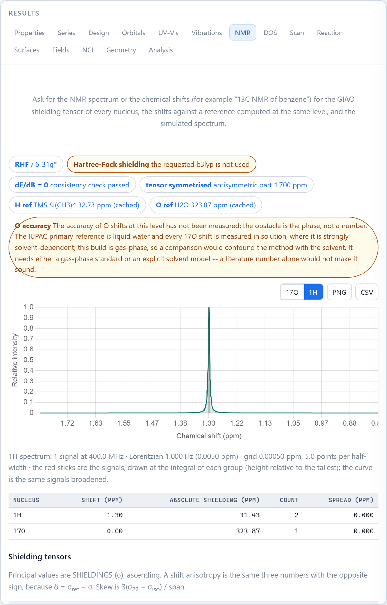
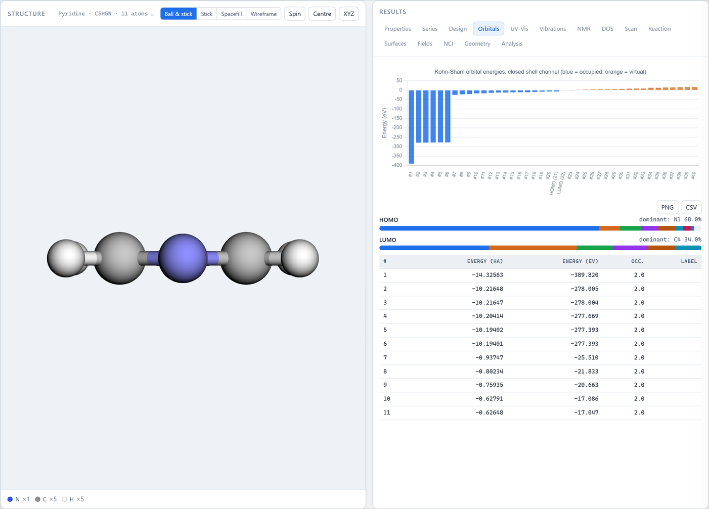
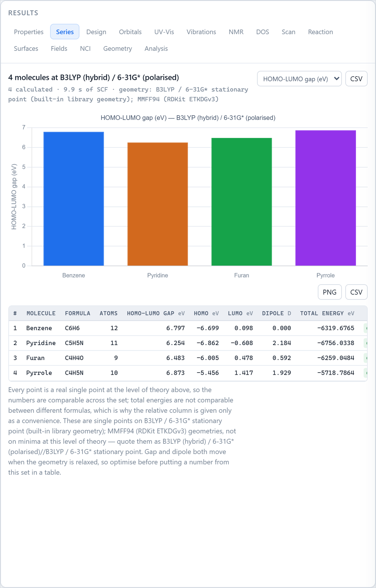
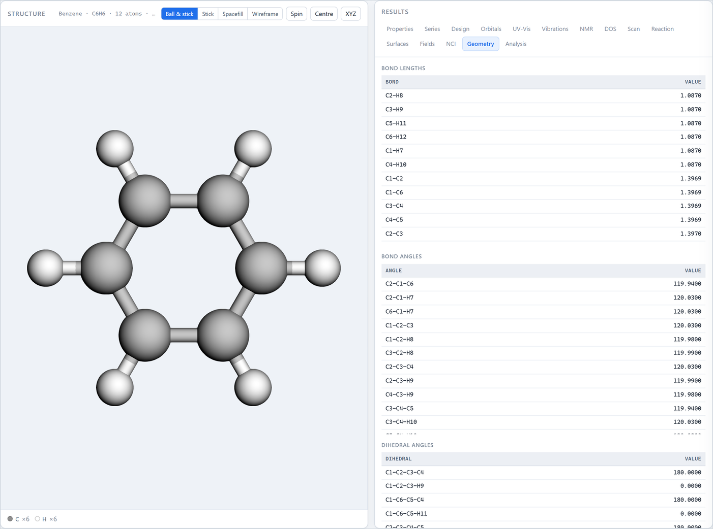
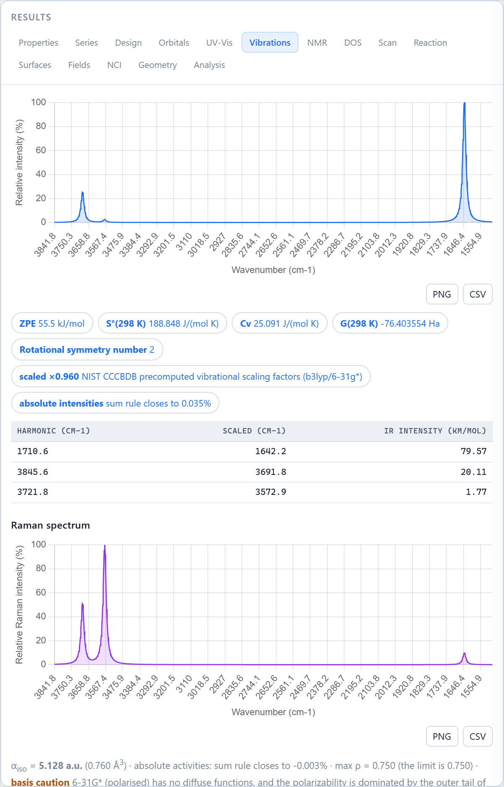
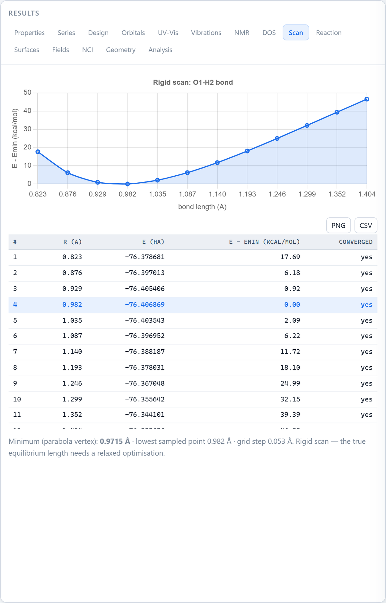

# ChatDFT

**Conversational density functional theory.** Ask a chemistry question in
plain language, get a real quantum-chemistry calculation back.

ChatDFT wraps [PySCF](https://pyscf.org/) — a production-grade electronic
structure code — in a natural-language agent, a live 3D structure viewer and a
results dashboard. Nothing is faked or looked up from a table: every energy,
orbital and optimised geometry you see is computed by an SCF solver running on
your machine, at the moment you ask for it.



### The workbench

Every picture below is a screenshot of the running application answering a real
question, and each one names the sentence that produced it. Nothing is mocked
up, composited or re-drawn — if the orbital looks like that, it is because SCF
produced it. Click any image to see it full size.


**The workbench** — chat, 3D structure and results, side by side.<br>
*“What is the HOMO-LUMO gap of naphthalene?”* — the answer, the property
cards, the atomic charges and the job history, all from one SCF run.



**UV-Vis absorption** · *“Compute the first 6 excited states of formaldehyde”*<br>
TD-DFT (Tamm–Dancoff) vertical excitations, Lorentzian-broadened, on a relative
and an absolute ε axis, with the oscillator strengths and ε<sub>max</sub> per band.



**NCI / RDG analysis** · *“NCI of the water dimer”*<br>
Reduced density gradient against sign(λ₂)ρ, with the cut-off reported and the
weak interaction named.



**NMR spectrum** · *“What are the NMR shieldings of water?”*<br>
GIAO shielding tensors against a reference computed by the same code, with the
integral drawn as the stick heights.



**Kohn–Sham orbital ladder** · *“What is the HOMO-LUMO gap of pyridine?”*<br>
Every orbital, labelled with its spin channel, and the Löwdin composition of
the frontier pair.



**Series and trend** · *“Show me a series of benzene, pyridine, furan and pyrrole”*<br>
Four molecules at one level of theory, so the numbers are directly comparable.



**Geometry optimisation** · *“Optimise the geometry of benzene”*<br>
Analytic-gradient BFGS, with the bond lengths and angles it converged to.



**IR spectrum** · *“Compute the IR spectrum of water”*<br>
Analytic Hessian, harmonic frequencies, absolute intensities in km/mol,
sum-rule checked.



**Rigid bond scan** · *“Scan the O-H bond of water”*<br>
Twelve points, the fitted minimum, and an anharmonicity check.

---

## What it does

| You type | What actually runs |
|---|---|
| *"Optimise the geometry of benzene with B3LYP/6-31G\*"* | Analytic-gradient BFGS geometry optimisation |
| *"What is the HOMO-LUMO gap of pyridine at PBE0/def2-TZVP?"* | SCF + orbital analysis |
| *"Compute the first 6 excited states of formaldehyde"* | TD-DFT (Tamm-Dancoff) |
| *"Compare phenol and aniline"* | Two identical-level single points, side by side |
| *"Explain what a basis set is"* | Concept explanation, no calculation |
| *"TD-DFT on naphthalene in water"* | SCF with a ddCOSMO implicit solvent |
| *"Scan the O-H bond of water"* | Rigid potential-energy curve, 12 points |

Supported out of the box:

* **Functionals** — HF, LDA, PBE, BLYP, BP86, B3LYP, PBE0, M06-L, TPSS, wB97X-D
* **Basis sets** — STO-3G through def2-TZVP and cc-pVDZ
* **Properties** — total energy, HOMO/LUMO/gap, Kohn-Sham orbital ladder,
  Mulliken and Löwdin charges, dipole moment, frontier-orbital composition
  (Löwdin population, so the shares are an exact partition and never negative)
* **Geometry** — bond lengths, bond angles, dihedral angles
* **Rigid bond scan** — drive one bond from 0.85 to 1.45 of its length and get
  the potential-energy curve, its minimum and an anharmonicity check. Name the
  pair (`scan the O-H bond of water`); if you omit it, the longest bond is
  used. The scan is *rigid* — the other nuclei stay frozen — so the minimum it
  finds sits slightly above the true equilibrium length
* **Open shell** — radicals, triplets and higher spin states via spin-polarised
  UKS/UHF. Free atoms use their true Hund's-rule ground states (atomic O is a
  triplet, atomic N a quartet, atomic Fe a quintet)
* **Implicit solvent** — ddCOSMO, with built-in permittivities for water,
  methanol, ethanol, acetone, DMSO, dichloromethane, chloroform, THF, toluene,
  benzene, acetonitrile and hexane
* **Molecule library** — 65 built-in structures spanning diatomics, aromatics,
  heterocycles, biomolecules, ions and radicals

### The figures a paper needs

Every entry below is a real calculation, and the parameters that produced it are
written into the payload, so the figure can be reproduced or quoted.

| Figure | Ask for it as | What it is |
|---|---|---|
| UV-Vis absorption curve | *"UV-Vis of formaldehyde"* | TD-DFT (or TDA) vertical excitations, Lorentzian-broadened, on both a relative axis and an absolute ε (L mol⁻¹ cm⁻¹) axis, with the oscillator strengths and ε_max per band |
| IR spectrum | *"IR spectrum of water"* | Analytic Hessian, harmonic frequencies, absolute intensities in km/mol (sum-rule checked) |
| Raman spectrum | *"Raman spectrum of water"* | Polarizability derivatives by CPHF, activities in Å⁴/amu and depolarization ratios |
| NMR spectrum | *"13C NMR of benzene"* | GIAO shielding tensors, chemical shifts against a reference computed by the same code, one axis per isotope, with the integral as stick heights |
| NMR shielding tensors | same job | Principal values, span, skew, reduced anisotropy, per nucleus |
| Kohn-Sham orbital ladder | *"orbital energies of pyridine"* | Every orbital, labelled with the spin channel |
| Density of states | *"DOS of pyridine"* | Total and element-projected, as a normalised density (area = number of states) |
| Potential-energy scan | *"scan the O-H bond of water"* | Rigid PES with the fitted minimum and the grid step it came from |
| Reaction path and barrier | *"reaction path for the torsion of ethane"* | Relaxed scan, located transition state, IRC, and ΔE‡ / ΔE₀‡ / ΔH‡ / ΔG‡ |
| Orbital isosurfaces | *"HOMO of benzene"* | 3D isosurface |
| MEP map | *"electrostatic potential of water"* | Molecular electrostatic potential on a colour-mapped surface |
| ELF, Laplacian, spin density, density difference | *"ELF of benzene"*, *"spin density of the methyl radical"* | Real-space fields, with the isovalue reported |
| NCI / RDG analysis | *"NCI of the water dimer"* | Reduced density gradient vs sign(λ₂)ρ, with the cut-off reported |
| NTOs | *"natural transition orbitals of formaldehyde"* | The hole/particle pair and its weight |
| 2D contours | *"density contour of water"* | Planar contour of any of the real-space fields |
| Molecule comparison | *"compare phenol and aniline"* | Two single points at one level, side by side |
| Series and trend | *"compare these 8 molecules"* | N molecules at one level, per-molecule properties, a trend chart and a table |
| Charges and bond orders | any single point | Mulliken, Löwdin and Hirshfeld charges, and Mayer bond orders |

### Naming molecules

ChatDFT accepts a name, a formula, a SMILES string or a full XYZ block. The
readings are disambiguated in a fixed order — library name, then element, then
formula, then SMILES — with chemical formulae treated as **case-sensitive** so
that the usual chemistry conventions hold:

| Input | Resolves to | Why |
|---|---|---|
| `CO` | carbon monoxide | formula match (case-sensitive) |
| `Co` | cobalt | element symbol, capital-C lower-case-o |
| `co` | carbon monoxide | lower-cased formula convenience |
| `CCO` | ethanol | SMILES, named back from the library |
| `c1ccncc1` | pyridine | SMILES, named back from the library |
| `h2o` | water | lower-cased formula convenience |
| `No` | *(rejected)* | mixed case is not guessed at |

---

## Quick start

**On Windows, just double-click `run.bat`.** It finds the Python environment,
starts the server and opens your browser at <http://127.0.0.1:8000>.

To choose a different port: `run.bat 9000`.

### Starting it by hand

```bash
cd <this folder>
python -m backend.server            # honours CHATDFT_HOST / CHATDFT_PORT
```

Then open **http://127.0.0.1:8000**. You do **not** need to activate a conda
environment first — `backend/bootstrap.py` puts the native libraries (libcint,
libxc, MKL) on the search path automatically at start-up.

### Requirements

* Python 3.10 – 3.13
* PySCF ≥ 2.4, RDKit ≥ 2023.9, FastAPI, NumPy, SciPy, `geometric` (or `pyberny`)
* A modern browser with WebGL (for the 3D viewer)

```bash
python -m venv .venv
.venv/Scripts/pip install -r requirements.txt      # Windows
# source .venv/bin/activate && pip install -r requirements.txt   # macOS / Linux
```

> **Building PySCF from source on Windows.** PySCF publishes no binary wheels
> for Windows, so it has to be compiled. This machine already has a working
> build installed in the conda environment `biochar-dft`. The full recipe —
> including the five upstream portability bugs that have to be patched and the
> MKL/PATH traps — is written up in
> `.workbuddy-ai/memory/2026-09-12.md`, and `install_pyscf.py` automates the
> install step.

### Checking the installation

```bash
python -m backend.selftest          # fast tier: 57 checks
python -m backend.selftest --full   # adds optimisation + TD-DFT: 62 checks
```

Every check compares a real calculation against an experimental or literature
value, so a passing run means the physics is genuinely working.

To exercise the whole stack end to end — every input syntax, a spread of
functionals and basis sets, open-shell and charged species, geometry
optimisation, TD-DFT, solvation, comparison jobs, concept questions, error
paths and a set of reference values — start the server and run the sweep
against the live HTTP API:

```bash
python -m backend.sweep            # full sweep, 76 checks, ~4 minutes
python -m backend.sweep --fast     # skips optimisations and TD-DFT
```

The built-in molecule library is a data file, and a corrupt entry is the
worst kind of bug here: the geometry resolves, the SCF converges, and every
number downstream is quietly wrong. (Naphthalene once shipped with two
hydrogens 0.43 A from a ring carbon, which collapsed its HOMO-LUMO gap to
2.29 eV; furan and pyrrole stored a six-membered ring.) Two more gates guard
that file:

```bash
python -m backend.check_library     # geometric sanity of every entry
python -m backend.rebuild_library   # regenerate any bad entry from its SMILES
```

`check_library` verifies that no nuclei overlap, that every hydrogen has a
heavy neighbour inside its element's bond limit, that bond lengths and
coordination numbers are chemically plausible, and that the stored formula
matches the atoms actually present. `rebuild_library` repairs a failing entry
by re-embedding its own SMILES with RDKit, so `smiles`, `formula` and `xyz`
cannot drift apart. The sweep then re-checks the downstream fingerprint
(gaps and dipoles) of the molecules that were repaired.

Finally, two static checks that catch the bugs API tests cannot see — a render
function reading a missing field, or a selector that matches nothing:

```bash
python backend/check_selectors.py   # every DOM selector exists in the markup
python -m backend.contract          # every field the UI reads is in the payload
```

`contract` also polices the *prose*, because the defects that survive testing
tend to be sentences that still read plausibly while saying the wrong thing.
It asserts that the narration names the atom that really carries the most HOMO
density, calls the strongest TD-DFT transition strongest, names the
largest-magnitude partial charge, and describes a charge separation as a
separation rather than a concentration. It also checks the numbers behind the
prose: frontier contributions must lie in 0–100% and sum to at most one
orbital, and water's LUMO must be hydrogen-dominated. Each of those has been
wrong at some point; every run of every SCF still passed while they were.

---

## How it works

```
  natural language
        │
        ▼
  ┌─────────────────┐   intent: molecule, method, basis,
  │  agent/planner  │   charge, spin, solvent, job type
  └─────────────────┘
        │
        ▼
  ┌─────────────────┐   name / formula / SMILES / XYZ
  │ engine/molecule │ ──► 3D coordinates (RDKit ETKDG + MMFF94)
  └─────────────────┘
        │
        ▼
  ┌─────────────────┐   SCF · geometry opt · TD-DFT
  │   engine/dft    │ ──► PySCF
  └─────────────────┘
        │
        ▼
  ┌─────────────────┐   plain-language interpretation
  │ agent/planner   │ ──► "the HOMO sits mainly on N1, so ..."
  └─────────────────┘
```

### The language layer

By default ChatDFT uses a **built-in offline parser** built from chemistry-aware
patterns. It understands names, formulas, SMILES, functionals, basis sets,
charges, multiplicities and solvents — and it needs no API key or network
access, so the application is fully functional the moment you start it.

To have a model read free-form phrasing instead, point it at any
OpenAI-compatible endpoint — in the environment:

```bash
export CHATDFT_LLM_BASE=https://token.sensenova.cn/v1
export CHATDFT_LLM_KEY=sk-...
export CHATDFT_LLM_MODEL=sensenova-6.8-flash-lite
```

or in `data/llm.json`, which takes effect when the environment is empty:

```json
{"base": "https://token.sensenova.cn/v1", "key": "sk-...",
 "model": "sensenova-6.8-flash-lite", "fallback_models": ["deepseek-v4-flash"]}
```

**Both readers go through one place.** `agent.llm.LLMClient` resolves the
configuration and does the transport, and `agent.planner.LLMPlanner` is built on
top of it. That is not a style preference — the planner used to read the
environment itself, so with a key in `data/llm.json` and nothing in the
environment `GET /api/llm` answered `available: true` while every message typed
into the chat box was matched by regular expressions, with nothing anywhere
saying so. `GET /api/llm` reports what the client sees; the planner asks the
same client, so the two cannot disagree.

Three consequences worth knowing:

* **Every reply says who read your sentence.** The response carries
  `planner: "llm" | "local"`, and the notes carry either `planned by <model>`
  or a sentence naming why the model was not used. The intent card shows it, so
  a model-parsed request and a pattern-matched one do not look identical.
* **A fallback always names its reason.** The note begins `language model
  unavailable (...)` with the actual error in the brackets, and that wording is
  what the front end keys its warning box on. A silent fallback is a defect
  here, not a graceful degradation.
* **A reply is checked before it is trusted.** A model that returns
  `job_type: "nmr_spectrum"` or `molecules: "water"` has that field refused and
  reported; the parser's value stands. Otherwise a job type the server cannot
  dispatch would reach the intent and surface much later as a missing branch.

A planning call is bounded by `PLAN_TIMEOUT` (30 s, then the parser takes over
and says so). Measured on this endpoint the same one-line request returns in
5–64 s, and a chat turn that hangs for a minute is worse than one that answers
at once and is honest about how.

`CHATDFT_PLANNER` overrides the choice: `auto` (the default), `local` (the
parser, with the reason attached) or `llm`. The regression gates run the server
with `local` — a suite that spends model latency on every chat call fails for
reasons that have nothing to do with the code, and an account-level rate limit
would look exactly like a broken router. `backend.check_planner` is the gate
that covers the model path.

That sentence is only true if the suite is testing *its own* server, so
`backend.gates` now refuses to start when something is already listening on
port 8000, and re-reads its own server log after the health check to catch a
bind that failed anyway. Before that guard, a development server on 8000 made
every gate run against a different configuration while reporting PASS — the
spawned server had exited with `[Errno 10048]` and the log that said so was in
a temp directory. Stop the app before running the gates:
`python kill_gate_server.py`.

The gates also report what they could **not** run. `check_shift_scales`
recomputes five nuclei, and the memory guard refuses a molecule when the
machine is short of physical memory — `chloroform_f` is nao = 82 and priced at
3.0 GB. That refusal used to end the run with a traceback, and a gate that
crashes reports neither pass nor fail; worse, the verdict line counted what was
*asked for* rather than what *ran*, so a nucleus that was never recomputed
still printed as `5 of 5`. A refusal is now named in the verdict line and fails
the run, because an assertion that never ran is not an assertion that passed.
Generate the missing references with `python -m backend.gen_nmr_cache` when the
machine has the RAM, and the next run is both faster and complete.

---

## API

The front end is a thin client over a documented HTTP API — you can drive
everything from a script.

```bash
# single point + full electronic structure
curl -X POST localhost:8000/api/job -H 'Content-Type: application/json' -d '{
  "molecule": "benzene", "kind": "single_point",
  "functional": "b3lyp", "basis": "6-31g*"
}'
# -> {"job_id": "a1b2c3d4", ...}

curl localhost:8000/api/job/a1b2c3d4
```

| Endpoint | Purpose |
|---|---|
| `POST /api/chat` | natural-language entry point |
| `POST /api/job` | structured job submission |
| `GET  /api/job/{id}` | poll status, fetch results and analysis |
| `GET  /api/jobs` | job history |
| `POST /api/molecule/resolve` | name / formula / SMILES → 3D structure |
| `POST /api/analyze` | immediate analysis of an XYZ block |
| `GET  /api/methods` | available functionals, bases, benchmarks |
| `GET  /api/library` | built-in molecule library |
| `GET  /api/health` | engine status |

Interactive documentation is served at `/docs`.

---

## Scientific honesty

Quantum chemistry is easy to misread, so ChatDFT states the caveats alongside
the numbers:

* **Absolute energies are not comparable** across different functionals, basis
  sets or geometries. Only differences computed at an identical level mean
  anything.
* **Kohn-Sham gaps are not measurable gaps.** A KS gap underestimates the
  fundamental (ionisation − affinity) gap, because the derivative
  discontinuity is missing from the exchange-correlation potential, yet it
  normally *exceeds* the first excitation energy — so it is neither. Use TD-DFT
  for excitation energies. It also does not identify the bonding: benzene
  (≈6.8 eV) and pyridine (≈6.3 eV) have large KS gaps and are aromatic.
* **Mulliken charges are basis-set dependent.** Adding diffuse functions can
  shift them by several tenths of an electron. Read them as trends, not as
  physical atomic charges. The Löwdin charges shown alongside are the same
  partition in the symmetrically orthogonalised basis and are markedly less
  sensitive — for water, O is −0.36 by Mulliken but −0.25 by Löwdin — so the
  two are worth comparing rather than reading either alone.
* **Orbital composition is a Löwdin population, not a sum of |c|².** Molecular
  orbitals are normalised as cᵀSc = 1, not cᵀc = 1, so summing squared
  coefficients per atom silently discards every overlap cross term. It looks
  fine on bonding HOMOs but inverts antibonding LUMOs — water's O–H σ\* came
  out as "O1 46%" when the weight really sits on the hydrogens. Even the
  textbook Mulliken gross population Σ c(S c) goes negative there, which
  cannot be drawn as a share; Löwdin, being a sum of squares in an orthonormal
  basis, is both exact and non-negative.
* **Charges separate more often than they concentrate.** Mulliken splits every
  overlap population evenly between the two atoms of a bond, which
  systematically understates the polarity of bonds to electronegative atoms:
  in acetone it puts more negative charge on the methyl carbons (−0.52 e) than
  on the carbonyl oxygen (−0.40 e). The narration therefore reports the
  electron-rich and electron-poor ends separately and cross-checks each against
  Löwdin, rather than listing the largest-magnitude atoms as one "site".
* **Geometry optimisation finds a local minimum.** The conformer you start from
  determines which one. ChatDFT embeds a single conformer from SMILES; for
  flexible molecules, check several.
* **TD-DFT vertical energies** are typically good to 0.2–0.3 eV with a hybrid
  functional. Charge-transfer states need a range-separated functional.
* **ddCOSMO captures bulk electrostatics only** — no specific hydrogen bonding,
  no explicit solvent structure.
* **NMR shieldings are computed at Hartree-Fock, whatever functional you ask
  for.** `pyscf.prop` is not in this build at all — it was split into a separate
  repository, and neither the 2.5.0 nor the 2.6.2 source distribution contains a
  single `pyscf/prop` path — so the GIAO shielding is written from its
  definition here. That needs a complex density, and this build's DFT
  integrator rejects one outright, so the shielding is evaluated at RHF in the
  requested basis. Measured against gas-phase experiment at RHF/6-31G\*, the
  shifts are good to 0.7 ppm for ¹H across the whole range and to about 3 ppm
  for ¹³C, except acetylene's carbon (5.7 ppm, the known weakness on a triple
  bond — no correlation and no diffuse functions, though the ordering is still
  right). Absolute ¹⁷O shieldings are about 14 ppm out. That summary used to
  carry a count ("eight of twelve inside 2.5 ppm") and a mean, and both had
  gone stale: the library's geometries were re-derived underneath them, the
  count was never right for ¹³C in the first place, and the mean had drifted
  from 1.89 to 1.736 ppm. The twelve rows are now **data**
  (`backend.engine.nmr.SHIFT_LEDGER`), the tolerance for each nucleus is a
  claim about *all* of that nucleus's rows rather than about one molecule, and
  `backend.check_shift_scales` recomputes every row through the same shielding
  path a real job uses. The counts and the mean are printed by the gate, not
  written down, so there is nowhere for them to rot.
* **An NMR shift needs a reference computed by the same code.** The shift is
  δ = σ(reference) − σ(sample), and a tabulated reference from another program
  or another basis would put a constant offset on every number where it could
  not be seen. The references (TMS for ¹H/¹³C/²⁹Si, NH₃ for ¹⁴N, H₂O for ¹⁷O,
  PH₃ for ³¹P, CFCl₃ for ¹⁹F, (CH₃)₂Se for ⁷⁷Se) are therefore computed at the
  same level and cached on disk. The NMR-active elements with **no** reference
  in this build at all — Al, B, Br, Cl, D, Hg, I, Li, Na, Pb, Pt, S, Sn — are
  named rather than dropped, so a
  molecule containing one of them (thiophene, say) names it in
  `unreferenced_elements`, warns about it **and says why**, and gives it an
  absolute shielding and **no** shift: quoting the absolute shielding as
  though it were a shift would be wrong by the whole scale (³³S spans
  964 ppm, −290 to 674). The reasons are recorded per element in
  `NO_REFERENCE_WHY` and a gate asserts that the set of reasons is exactly the
  set of unreferenced nuclei, so the two cannot drift apart. They are not all
  the same reason, and which ones are in 6-31G\* at all was measured rather
  than assumed (`gto.basis.load`; building a bare atom answers a different
  question and got seven of them wrong on the first attempt):

  * **Not in the basis at all** — Hg, I, Pb, Pt, Sn.
  * **The standard is a solution, not a molecule** — ⁷Li (LiCl/D₂O),
    ²³Na (NaCl/D₂O), ²⁷Al (Al(NO₃)₃/D₂O), ³⁵Cl (NaCl/D₂O), ⁸¹Br (NaBr/D₂O)
    and ³³S (saturated (NH₄)₂SO₄ in D₂O). A gas-phase isolated ion is not on
    that scale, and the halide anions would need diffuse functions 6-31G\*
    does not have — computing them would produce a number wearing another
    scale's name, which is the failure the ¹⁵N/³¹P notes above exist to
    prevent.
  * **The standard is a molecule that will not fit** — ¹¹B (BF₃·OEt₂: 19
    atoms, 146 basis functions, 30.6 GB by the memory estimate, four times
    the budget).
  * **Not a reference problem at all** — ²H. This bullet used to read
    "neither impossible nor done — ²H is in the basis and could have a
    molecular reference (TMS-d₁₂)", and every part of that was wrong.
    Deuterium is not in the basis because it is not an element this build can
    build: the builder's element table has no deuterium, so no job can contain
    a ²H atom and **no reference compound would help it**. That is recorded in
    `UNBUILDABLE_NUCLEI`, which is a different table from this list for the
    reason this list exists — the two need different work. `D` in an xyz file
    is refused by name; a SMILES that labels an isotope is now refused too.
    It used to be *silently converted*: `[2H]C([2H])([2H])[2H]` came back as
    CH₄, so a request for CD₄ was answered with methane's numbers and nothing
    said so. And even given a reference, a ²H shift computed here would be a
    ¹H shift wearing a ²H label: every shielding is evaluated at the
    clamped-nucleus level, where the two isotopes are the same electronic
    problem. ⁷⁷Se sat in this list until this round; it now has a reference and
    is computed, and the reason it still produces no shift is a different one
    again, recorded in the accuracy ledger below.
* **The reference has to sit at the geometry the molecule has.** ¹⁷O shielding
  moves by **539 ppm per Å of O–H** (measured: 323.87 ppm at O–H 0.9686 Å,
  329.60 at 0.9579, 329.98 at 0.9572), so a reference computed at a geometry
  the sample does not have is not a rounding error — the library's water and an
  earlier hard-coded experimental water were 0.0114 Å apart, which is 6.11 ppm
  on every ¹⁷O shift in the output. Where the molecule library ships the same
  compound, the reference therefore uses **the library geometry**, so computing
  that molecule gives a shift of exactly zero; where it does not (TMS, PH₃,
  CFCl₃) a documented experimental geometry is used. The payload records which,
  per nucleus, and the geometry it records is derived from the coordinates
  rather   than typed, so it cannot describe a geometry the job did not run at.
* **The cache key carries the geometry and the code.** The geometry went in
  after a 0.374 ppm offset on every ¹⁷O shift turned out to be one reference
  geometry being read as if it belonged to another. The code went in later, for
  the same reason one level up: `data/nmr_cache` ships as data, so an upgraded
  tree kept the previous version's numbers, and a reference computed by other
  code is a constant offset on every shift the product prints with nothing in
  the output to reveal it. The version is not a constant anyone has to remember
  to bump — `nmr._method_signature()` hashes the source of the four functions
  that produce the number plus the constants they use, so editing any of them
  invalidates every entry that depends on it and nothing else does.
  `backend.check_shift_scales` asserts both halves: that varying the method
  moves the key, and that the reader refuses an entry stamped with another
  method even when it is handed one directly. **After changing the shielding
  code, re-run `python -m backend.gen_nmr_cache`** — nothing breaks if you do
  not (the engine recomputes and rewrites on first use) but the first job pays
  what the cache should have paid once.
* **A reference makes a shift definable, not correct — and that difference is
  now a table rather than a sentence.** ¹H and ¹³C are reproduced. ¹⁴N comes out
  24 % high and ¹⁹F 22 % low — right sign, right ordering, wrong magnitude — and
  ⁷⁷Se is not reproduced at all. Each is recorded in `SCALE_CHECK` with the
  molecule it was measured on, the number it was measured at, and a tolerance,
  and `backend.check_shift_scales` recomputes every entry through the product's
  own code path, so the claim cannot rot. A nucleus whose scale is measured and
  **not** reproduced keeps its absolute shielding and gets no shift, with the
  reason printed on the figure: the method's *entire* Me₂Se → H₂Se response is
  **101 ppm** against a ⁷⁷Se range of **3000 ppm**, and the reference's own
  shielding moves **72 ppm** between two defensible geometries of (CH₃)₂Se, so
  the answer would be dominated by a geometry choice this build makes
  arbitrarily. Three more nuclei (¹⁷O, ²⁹Si, ³¹P) are referenced and have never
  been measured here. They are recorded in `SCALE_UNMEASURED` **as a named pair
  and a computed number**, recomputed by the same gate: "unmeasured" and "never
  computed" are different states needing different work, and a sentence cannot
  tell them apart. The numbers are pinned rather than kept out of the prose for
  a reason this round established — numbers rot when *nothing recomputes them*,
  which is how the twelve-shift table went stale, not because they are numbers.
  The three say different things. ³¹P produces a real scale — each methyl
  deshields phosphorus, and that is a *checked* claim rather than a stated one:
  the entry carries the direction, the gate recomputes the step (measured
  **+40.93 ppm** against a 5 ppm floor, because a sign test is satisfied by
  numerical noise) — and ²⁹Si does too (silane upfield of TMS, which is the
  experimental direction), so what is missing for those two is one verified
  experimental shift. ¹⁷O is not a missing number at all: the IUPAC primary
  reference is *liquid* water and ¹⁷O shifts are measured in solution where they
  are strongly solvent-dependent, so a gas-phase calculation compared against a
  solution measurement would confound the method with the solvent. Each entry
  **interpolates** its own numbers into the sentence a user reads rather than
  typing them a second time, and declares whether its reason is a measurement or
  an argument — a number written twice is a number that can contradict itself,
  and "this reason quotes no number" and "the number fell out of the text" look
  identical unless the entry says which it is. Each tolerance is
  itself asserted to be *falsifiable*: no wider than three times the error it
  was measured at. The ledger shipped with a 2.5 ppm tolerance on ¹H, inherited
  from that twelve-shift table where one band covered ¹H and ¹³C together — and
  since the whole ¹H shift range is about 12 ppm, the ¹H half of the table could
  not have failed at all. It is 1.0 ppm now, which is a claim something can
  fail. The gate also falsifies its own drift band and its trend floor on every
  run, because a check that never fires prints the same PASS as one that works:
  the proof is named in the verdict line rather than left implicit.
* **Two nuclei are quoted against a secondary reference, and say so.** The
  IUPAC primary reference (Harris *et al.*, *Pure Appl. Chem.* **73**, 1795
  (2001)) is used for ¹H, ¹³C, ²⁹Si (TMS), ¹⁷O (H₂O), ¹⁹F (CFCl₃) and ⁷⁷Se
  (neat Me₂Se). ¹⁵N and
  ³¹P are not, and the reason is what the standard costs: ¹⁵N's primary
  reference is nitromethane (66 basis functions, ≈1.3 GB by the estimate
  below), and ³¹P's is *85 % H₃PO₄ in water*, which is not a molecule a
  gas-phase program can compute at all — phosphoric acid alone is 85 basis
  functions and ≈3.5 GB. Both are therefore quoted against small hydrides,
  NH₃ and PH₃, and every shift carries a sentence naming the primary standard
  and how to get onto it: subtract **380.2 ppm** for ¹⁵N; for ³¹P the offset
  is PH₃'s own shift on the H₃PO₄ scale and is declared *not computed here*
  rather than implied to be zero. Naming the reference compound alone would
  not be enough — 380 ppm is bigger than the whole ¹⁵N range of most
  functional groups, and a user comparing with a paper would read the scale
  difference as an error in the calculation.
* **The NMR memory guard is calibrated, not counted.** Refusing a calculation
  it cannot fit is only honest if the number in the refusal is right, and the
  constant was originally *derived*: the arrays live at the worst point add to
  56 bytes per nao⁴. Measured, by sampling the peak resident set of the
  shielding machinery alone for nao = 18, 20, 32 and 54, the true figure is
  **68.8 bytes per nao⁴** with an intercept of +0.2 MB and R² = 0.99997 — the
  array list misses the temporaries of the transform that builds each
  direction. The 23 % shortfall is not academic: the TMS reference that was
  estimated at 5165 MB against a 6000 MB budget, *passed*, and then spent
  4829 s swapping instead of 285, was really 6346 MB and should have been
  refused. The constant is now 69, and the assertion that guards it is
  written in measured bytes per nao⁴ rather than in the GB it happens to
  produce, so it fails on a wrong number instead of on a changed one.
  Correcting it also exposed a second failure mode, in the other direction:
  the hard budget was 6000 MB, chosen when TMS *looked* like 5165 MB, and the
  measured constant puts it at 6364 MB — so the budget would have refused the
  reference outright, on any machine, for ever. Nothing would have said so:
  the budget is checked only when the cache misses, and every gate runs with
  the cache warm, so the symptom would have been a fresh install silently
  losing every ¹H, ¹³C and ²⁹Si shift. The budget is now 7500 MB and a gate
  asserts that **every** reference fits it, which is the check whose absence
  let that through.
* **Every nucleus the program can shift is reachable from the library by
  name.** The library reached 62 entries without a single one containing
  phosphorus: ³¹P had a reference compound, a scale note, an entry in the
  isotope list and a spectrum channel, and no molecule a user could ask for by
  name — the feature existed only for people who already knew a SMILES.
  Nothing had stated the coverage rule, so nothing could notice the gap. Two
  phosphines now close it, and they are a *pair* on purpose: PH₂Me and PHMe₂
  are the first two rungs of the successive-methylation trend, which is a real
  ³¹P phenomenon (computed here as +66.41 and +107.34 ppm against PH₃ — the
  direction and the spacing are right; the absolute placement cannot be
  checked, because the offset from PH₃ to the primary standard 85% H₃PO₄ is
  the one number this build does not compute). They are deliberately *not*
  phosphine itself: PH₃ is the ³¹P reference compound, and shipping it in the
  library would swap the experimental r_e reference for an MMFF94 geometry and
  move the whole scale — ³¹P shielding moves by 2.819 ppm between two
  geometries of PH₃ alone. A gate now asserts that every referenced nucleus is
  carried by at least one library entry.
* **Every geometry says where it came from, and that claim is checked.** A
  number is computed *on* a structure, so "B3LYP/6-31G\* // MMFF94" only means
  something if the second half is true. It used not to be: all 62 library
  entries were stamped `MMFF94 (RDKit ETKDGv3)`, yet re-embedding them from
  their own SMILES reproduced just 25 of them, and two of the remainder were
  not molecules at all — methanol closed an H–C–H angle of 62° with two
  methyl hydrogens 1.0938 Å apart, and ozone carried O–O = 1.4064 Å against
  an experimental 1.2717 Å. Each entry must now meet one of two standards:
  the SMILES pipeline rebuilds it to 10⁻⁵ Å, or it is a verified stationary
  point of B3LYP/6-31G\* (one analytic gradient against the optimiser's own
  thresholds, so the test cannot be looser than the optimisation). Anything
  meeting neither — 35 entries — was relaxed here and relabelled, leaving 25
  force-field conformers and 37 structures this program optimised. `python -m
  backend.verify_library_geometry --check` re-verifies all 62 in about two
  minutes and is a gate. Built from SMILES, a molecule MMFF94 cannot
  parametrise (boron hydrides, the diatomics, bare ions) is relaxed with UFF
  and says so, instead of being credited with a force field that returned −1
  and was never applied.
* **Raman intensities need a diffuse basis.** The polarizability is set by the
  outer tail of the density: at 6-31G\* water's isotropic polarizability is 48%
  low and its anisotropy is wrong by a factor of 4.9, and the depolarization
  ratio is built entirely from the anisotropy. Raman still runs without diffuse
  functions, but the payload marks the result unreliable and says why.
* **Technical limits** — jobs are capped at 80 atoms (50 for optimisation) so an
  interactive session stays responsive. Larger systems need a batch queue.
  NMR additionally needs O(nao⁴) memory for the GIAO two-electron derivative
  and refuses a molecule it cannot fit, naming the shortfall.

Every calculation reports whether the SCF actually converged. If it did not, the
numbers are flagged as indicative rather than presented as valid.

---

## Layout

```
ChatDFT/
├── backend/
│   ├── engine/              the chemistry
│   │   ├── elements.py      periodic table, radii, bond perception
│   │   ├── molecule.py      XYZ / SMILES / library → 3D structure
│   │   ├── dft.py           PySCF driver: SCF, opt, TD-DFT
│   │   ├── nmr.py           GIAO shieldings, references, the accuracy ledger
│   │   ├── analysis.py      Raman, UV/Vis, thermochemistry, spectra
│   │   ├── bonding.py       NBO, NCI, ESP, orbitals, DOS
│   │   ├── fields.py        electric field / point charge perturbations
│   │   └── reaction.py      NEB transition states, IRC
│   ├── agent/
│   │   ├── llm.py           the one HTTP client (config, retries, fallback)
│   │   ├── planner.py       sentence → job intent, and result narration
│   │   ├── designer.py      automatic molecular design
│   │   └── quality.py       scores a designed candidate before it is run
│   ├── server.py            FastAPI application
│   ├── bootstrap.py         makes the native (MKL / PySCF) libraries loadable
│   ├── selftest.py          physics validation against literature values
│   ├── sweep.py             end-to-end functional sweep over the live API
│   ├── gates.py             runs every regression gate, with a source guard
│   ├── contract.py          result-payload contract audit vs the front end
│   ├── check_*.py           the regression gates (library, NMR scales,
│   │                        planner, fields, NTO, reaction, series, selectors)
│   ├── browser_*.py         headless-browser gates over the real UI
│   ├── mutate_common.py     the preflight every mutation harness runs first
│   ├── mutate_*.py          mutation harnesses (NMR, library, planner, Raman, UV)
│   └── rebuild_library.py   re-embeds a bad library entry from its SMILES
├── frontend/static/
│   ├── index.html           single-page shell
│   ├── css/app.css          stylesheet
│   └── js/app.js            chat, viewer, charts, results
├── data/molecules/
│   └── library.json         built-in molecule library (65 entries)
├── data/nmr_cache/          computed reference shieldings, keyed by geometry
├── data/llm.example.json    LLM config template; copy to data/llm.json
├── probes/                  the scripts that measured the constants in nmr.py
├── reports/                 per-round audit reports (Chinese, self-contained)
├── docs/img/                the screenshots above, captured from the running app
└── requirements.txt
```

Three things are deliberately absent, and each is regenerable rather than
lost. `build/` and `tools/` (about 2.1 GB) hold the PySCF and MinGW build
toolchain — rebuild it with `build_pyscf.bat` / `install_pyscf.py`.
`data/cubes/` (382 MB) holds density volumes the server writes on demand.
And `data/llm.json` is not in the repository because it holds a live API key;
`data/llm.example.json` is the template to copy. `.gitignore` records the
reason for every exclusion.

---

## Licence

Application code is released under the MIT licence. PySCF and RDKit carry their
own licences (Apache-2.0 and BSD respectively) — check them before redistribution.
